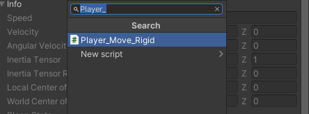
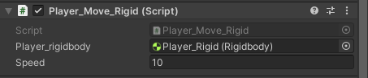
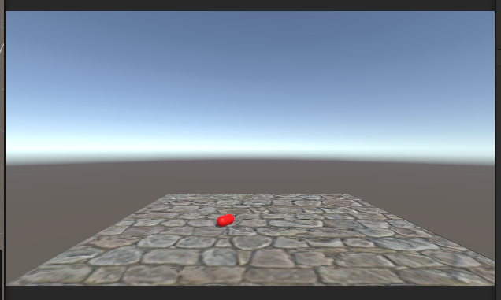
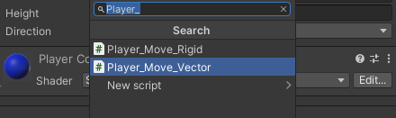

# 🚶3D 공간에서 Player 이동 구현하기🚶‍♂️

---
작성자 : 19 김성우
<pre>
Player의 이동을 구현하는 방법은 2가지가 있습니다.
1. Rigidbody에 힘을 가하여 움직이는 방법
2. 오브젝트의 현재 위치에서 주어진 벡터만큼 이동하는 방법

Rigidbody에 직접 힘을 가하면 가속력, 관성 등이 발생하기 때문에 진행중인 물체가 다른 방향으로의 즉각적인 방향 전환이 어렵습니다
벡터를 사용하여 이동하는 방법은 현재 오브젝트를 단순히 벡터 방향으로 옮기는 것이기 때문에 부드럽게 움직일 수 있습니다.
두 방식 모두 장단점이 있으므로 본인이 제작하려는 게임에 어울리는 이동방식을 선택하여 Player 이동을 구현하시면 됩니다.

</pre>

---

# 📓 Script Download

[1. Rigidbody에 힘을 가하여 움직이는 방법](https://github.com/starhome7/GG_Unity_GitHub/tree/f21b6dd298b05438b2fd7c11034985ea0658ee13/3D%20Scripts/1.%20Player%20%EC%9D%B4%EB%8F%99%20%EA%B5%AC%ED%98%84%ED%95%98%EA%B8%B0/Player_Rigid_Move_Script)

[2. 벡터를 사용하여 이동하는 방법](https://github.com/starhome7/GG_Unity_GitHub/tree/f21b6dd298b05438b2fd7c11034985ea0658ee13/3D%20Scripts/1.%20Player%20%EC%9D%B4%EB%8F%99%20%EA%B5%AC%ED%98%84%ED%95%98%EA%B8%B0/Player_Vector_Move_Script)

 

---

# 📝 Script 적용방법

## 1. Rigidbody에 힘을 가하여 움직이는 방법

>1. 플레이어로 사용할 오브젝트에 Rigidbody 컴포넌트를 추가합니다.

>2. 플레이어로 사용할 오브젝트에 Player_Move_Rigid 스크립트를 추가합니다.
 

>3. Player_Move_Rigid 컴포넌트에 플레이어의 Rigidbody 컴포넌트를 연결합니다. 
(Rigidbody를 끌어다 놓으면 됩니다.)

>4. 플레이를 눌러서 플레이어를 움직여보면 플레이어가 넘어져서 더 이상 움직일 수 없게됩니다.

>5. 플레이어의 Rigidbody의 Constraints(제약조건)에서 X/Y/Z 축 방향으로의 Rotation을 Freeze 해주면 4번 문제를 해결할 수 있습니니다.

## 2. 벡터를 사용하여 이동하는 방법

>1. 플레이어로 사용할 오브젝트에 Player_Move_Vector 스크립트를 추가합니다.

---

# ⚠️ 주의사항

## 1. Rigidbody를 이용한 이동

>1. Rigidbody 컴포넌트를 가지는 오브젝트는 물리법칙을 받게됩니다. 이동 구현을 위해 오브젝트에 AddForce로 힘을 가하게되면 가속도, 관성등이 생기게 되므로 플레이어가 방향전환을 할 때 즉각적인 방향전환이 어렵습니다.
>2. AddForce로 힘을 주는 방향은 월드 좌표계 기준 방향으로 힘을 주게됩니다.(자세한 내용은 좌표계 파트를 확인) 즉, 캐릭터가 바라보는 방향과 상관없이 언제나 같은 방향으로 이동하게 됩니다.

 

## 2. 벡터를 사용한 이동
>1. transform.Translate 함수의 2번째 인자로 기준 좌표계를 정할 수 있습니다. 기본 값으로는 로컬 좌표계로 설정이 되어있어서 
플레이어가 바라보는 곳을 기준으로 상/하/좌/우로 움직이게 됩니다.

  

# 🤝 같이 보면 좋은 파트

[1. 월드 좌표계와 로컬 좌표계](https://github.com/starhome7/GG_Unity_GitHub/blob/main/3D%20Scripts/1.%20Player%20%EC%9D%B4%EB%8F%99%20%EA%B5%AC%ED%98%84%ED%95%98%EA%B8%B0/1.%20Player%20%EC%9D%B4%EB%8F%99%20%EA%B5%AC%ED%98%84%ED%95%98%EA%B8%B0.md)

[2. Rigidbody란?](https://github.com/starhome7/GG_Unity_GitHub/blob/813796fbaa390228a2592245b372896aa8643f82/Unity_Basic/3.Rigidbody%EB%9E%80/3.Rigidbody%EB%9E%80.md)
