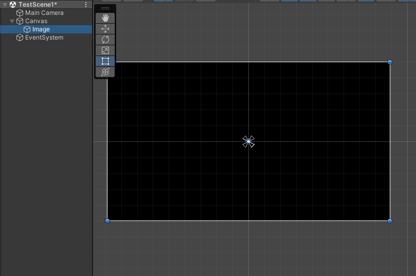

# 🚶UI로 FadeInOut 구현하기🚶‍♂️

---
작성자 : 22 김준모
<pre>
화면이 시작될 때 검은색이나 흰색에서 서서히 본 영상이 나타나게 하는 기법을 Fade In이라고 하며, 장면이 끝날 때 검은색이나 흰색으로 서서히 바뀌는 것을 Fade Out이라고 합니다.
<스크립트의 기능>
1. Fade In
2. Fade Out
3. FadeEffect

FadeEffect로 화면을 반복적으로 FadeInOut 하게 만들수 있습니다. 
</pre>

---

# 📓 Script Download

[FadeInOut 스크립트 추가중](https://github.com/starhome7/GG_Unity_GitHub/tree/f21b6dd298b05438b2fd7c11034985ea0658ee13/3D%20Scripts/1.%20Player%20%EC%9D%B4%EB%8F%99%20%EA%B5%AC%ED%98%84%ED%95%98%EA%B8%B0/Player_Rigid_Move_Script)
 

---

# 📝 Script 적용방법

## FadeInOut 적용 및 사용법

>1. UI에서 Image를 생성후 화면크기만큼 조정 후 Image색을 조절합니다.

>2. 생성한 Image에 FadeInOut 스크립트를 적용합니다
 

>3. Fade Time(작동 시간)과 Fade State(기능), Fade Curve(FadeInOut의 속도), LoopNum(반복하고 싶은 횟수) 를 원하는 만큼 조정합니다. 
(Fade Curve가 0에 가까울 수록 느리고 1에가까울 수록 빨라집니다.)

---

# ⚠️ 주의사항

>1. Fade State를 Fade Effect로 할때 Fade Time은 FadeIn -> FadeOut으로 전환되는 시스템입니다
>2. Fade Effect의 FadeTime은 FadeIn 후 FadeOut까지의 시간입니다

  

# 🤝 같이 보면 좋은 파트
