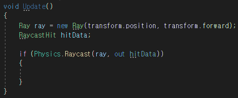
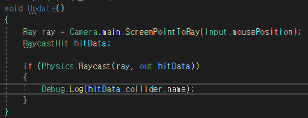
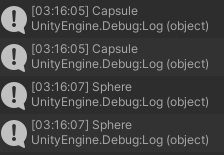
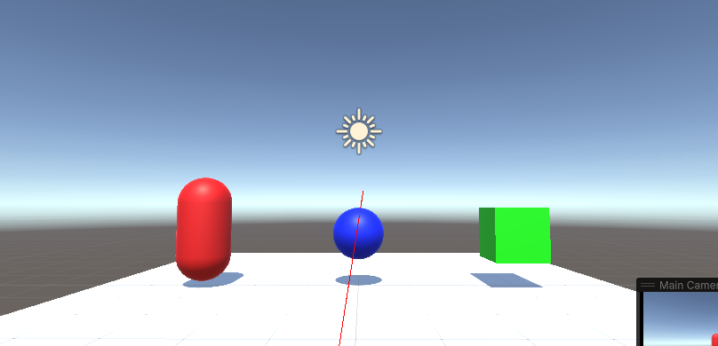

# ☝️ Raycast란 👉

---
작성자 : 19 김성우
<pre>
화면속에 있는 아이템들을 마우스로 클릭하는 것은 우리에게 어려운 일이 아닙니다.   
단순히 마우스를 움직여서 오브젝트 위에 놓은 뒤 클릭하면 해당 아이템이 선택됩니다.  
근데 뭔가 이상합니다. 잘 생각해보면 마우스포인터는 모니터라는 2차원 평면위에 존재합니다. 2D 게임이야 같은 2차원 평면이라 그렇다치더라도 
3D 게임의 오브젝트는 Z축이 존재할텐데 어떻게 2차원 평면 위의 마우스포인터가 오브젝트와 만날 수 있었을까요? 

</pre>

---

# 📓 Script Download

[1. 스크립트를 사용하여 애니메이션의 Parameter 설정하기](https://github.com/starhome7/GG_Unity_GitHub/blob/main/Unity_Basic/6.%20%EC%95%A0%EB%8B%88%EB%A9%94%EC%9D%B4%EC%85%98%EC%9D%B4%EB%9E%80/Animation_Script/Cube_Parameter.cs)

 

---

# ☝️ Raycast의 원리
위 질문에 대한 좋은 답변은 'Raycast' 입니다. Raycast를 가장 쉽게 이해할 수 있는 방법은 레이저포인터를 떠올리는 것입니다.
주로 학교에서 사용되는 레이저포인터는 멀리서도 칠판의 특정 위치를 가리킬때 사용됩니다. 유니티에서 사요되는 Raycast도 같은 원리로 동작합니다.
Raycast가 시작되는 지점에서 직선의 Ray(레이저)를 발사합니다. 그리고 레이저가 가장 먼저 도달한 물체의 콜라이더를 반환해줍니다.
첨부한 스크립트를 통해 Raycast의 원리를 실습해봅시다.

위와 같이 캡슐/구체/큐브 오브젝트가 있는 상황에서 실습을 진행하겠습니다.

<pre>
⚠️ 실습시 주의사항 ⚠️
1. 첨부되어있는 스크립트는 모든 단게가 끝난 후의 내용입니다.
2. 실습을 위해 단계별로 스크립트의 사진을 첨부했으니 참고바랍니다. 
3. 스크린(카메라)에서 Raycast를 쏘는 것을 기준으로 작성되었으니 참고바랍니다.
</pre>

1. Raycast의 기본 구조는 아래와 같습니다. 
> 
> 
>> Ray는 여러방법으로 생성할 수 있습니다. 시작점과 끝점을 주는 것이 가장 기본적인 방법이며 위 사진처럼 ScreenPointToRay를 사용하면 마우스 포인터 위치를 기준으로 Ray를 생성합니다.
> 
> >RaycastHit는 Ray와 충돌한 객체의 정보들을 담고있는 구조체 변수입니다.
> 
> >Physics.Raycast(ray, out hitData)의 리턴값은 bool값이다. ray에 충돌한 객체가 있다면 True, 없다면 False를 리턴합니다. 이를 사용하여 Ray에 객체가 부딪힌 경우 어떤 동작을 하도록 할 때 if문을 사용합니다.
> 
> >이를 활용하여 Ray에 걸린 객체의 이름을 출력하도록 스크립트를 수정해봅시다.

2. Ray와 충돌한 오브젝트의 이름을 출력하도록 수정한 스크립트입니다.
> 
>
> > 실행한 뒤 로그창을 확인해보면 내가 마우스를 올려놓은 오브젝트의 이름이 출력됨을 확인할 수 있습니다.
> 
> 
> >  잘 동작하기는 하지만 Ray가 육안으로 확인되지 않아서 불편하다고 느껴집니다. Ray를 육안으로 확인할 수 있도록 스크립트를 수정해봅시다.

3. Ray를 육안으로 확인할 수 있도록 수정한 스크립트입니다.
> 

# ⚠️ 주의사항

## 1. Raycast를 어떻게 활용해야 할까요?
이제 Ray를 쏘고 특정 오브젝트를 읽어오는 것 까지 할 수 있게 되었습니다. 아쉽지만 Raycast가 해줄 수 있는 것은 여기까지입니다.
읽어온 오브젝트에 어떤 이벤트를 줄지는 개발자가 하기 나름입니다. 마우스 클릭과 연계하여 오브젝트를 삭제할 수도 있을 것이고, 버튼을 누르는 작업도 할 수 있을 것 입니다.
또는 눈에 보이지 않는 오브젝트를 숨겨놓고 아이템, 오브젝트의 정보를 띄우는 것도 가능할 것 같습니다.

---

