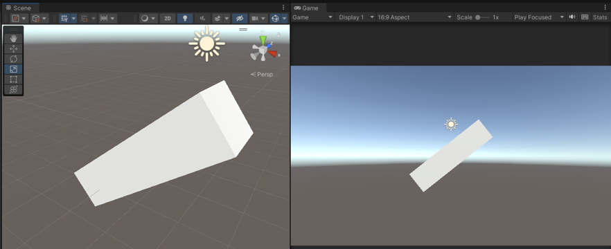
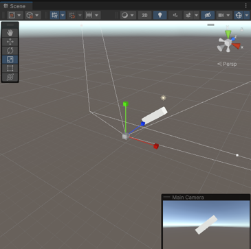

# 📷Scene과 Game의 차이🎮

---
작성자 : 19 김성우

<pre>
유니티 화면에 표현되어 있는 View에는 Scene View과 Game View 2개가 있습니다.  
처음 유니티를 사용하시는 분들은 Scene View와 Game View의 차이가 무엇인지 궁금할 것 입니다. 
이 페이지에서는 간단한 예시를 사용하여 두 View의 차이점을 설명합니다.
</pre>

---
# 👀 문제의 화면
> 
>   분명 같은 오브젝트를 보여주고는 있지만 Scene 화면은 오른쪽 대각선 방향에서, Game 화면은 정면에서 본 모습을 보여주고 있습니다.

# ❓Scene View와 Game View가 다르게 보이는 이유는 무엇일까?
> Scene View는 쉽게 영화 세트장을 생각하면 됩니다. 빈 세트장에 소품들을 배치하고 카메라로 찍으면 영화가 되는 원리와 같습니다.
>   이때 현실의 카메라의 역할을 유니티에서도 Camera 오브젝트가 해줍니다. 그리고 Camera 오브젝트가 찍은 장면이 Game View로 보여지게 됩니다.
> MainCamera 오브젝트를 클릭하면 Camera가 어떤 구도로 찍고있는지 확인할 수 있습니다.
>  
>   확인해보면 실제로 Camera는 큐브의 정면을 담고 있었기 때문에 Scene View와 Game View가 다르게 출력되었던 것입니다.

---

