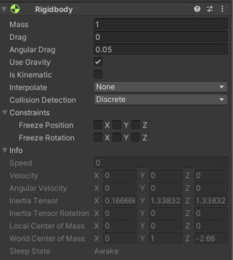

# 👷‍♂️Rigidbody란👷‍♀️

---
작성자 : 19 김성우

<pre>
유니티는 미리 구현해놓은 기능들을 컴포넌트로 제공하고 있습니다. 그 중 오브젝트에 물리 법칙을 적용시켜주는 컴포넌트가 바로 Rigidbody입니다. 
Rigidbody가 적용된 오브젝트에 AddForce로 힘을 가하면 특정 방향으로 힘을 가할 수 있습니다. 
이 페이지에서는 추가로 Rigidbody를 구성하는 요소들에 대해 간단히 설명해놓았으며 자주 쓰이는 속성들에 대해서는 제목에 블럭처리를 했습니다.
</pre>

---

# 🧺Rigidbody의 요소들
>   

>> 1. `👍Mass`
>>> 오브젝트의 질량을 의미합니다. Mass가 10인 오브젝트는 1인 오브젝트보다 10배 더 무겁습니다.
>> 2. Drag
>>> 이동시 적용되는 마찰계수
>> 3. Angular Drag
>>> 회전시 적용되는 마찰계수
>> 4. `👍Use Gravity`
>>> 물체에 중력을 적용합니다.
>> 5. `👍Is Kinematic`
>>> 오브젝트에 물리 법칙을 적용하지 않습니다.
>> 6. Interpolate
>>> 물리로 인해 움직임이 끊어지는 현상이 발생할 때 보간 처리를 해준다.
>>>> Interpolate : 이전 프레임의 Transform에 맞게 움직임을 부드럽게 처리합니다. 
>>>> Extrapolate : 다음 프레임의 Transform 변화를 추정하여 움직임을 부드럽게 처리합니다.
>> 7. Collision Detection
>>> 아주 빠른 물체에 대해서는 물리 엔진이 충돌 검출을 놓치는 경우가 발생할 수 있다. 
>>> 이런 경우에 대비하여 세밀한 충돌을 검출하기 위한 옵션이다.
>> 8. `👍Constraints`
>>> 특정 축에 대하여 물리 법칙을 제한한다.
>>>> Freeze Position : X, Y, Z축으로의 이동을 막는다. 
>>>> Freeze Rotation : X, Y, Z축을 기준으로 회전을 막는다.

