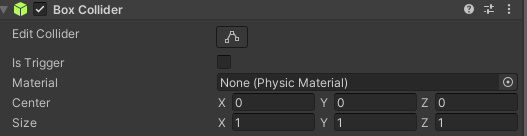
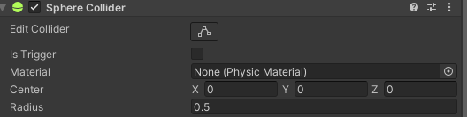
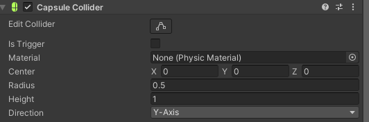
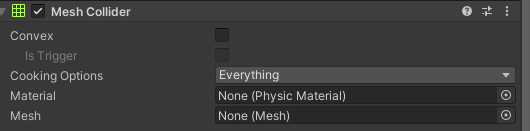
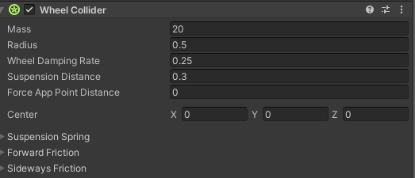

# 💥Collider란💥

---
작성자 : 19 김성우

<pre>
유니티는 미리 구현해놓은 기능들을 컴포넌트로 제공하고 있습니다. 그 중 충돌을 감지하는 컴포넌트가 바로 Collider 입니다. 
Collider가 적용된 오브젝트는 특정 조건이 만족되었을 때 충돌을 감지할 수 있습니다. 
2D와 3D는 함수이름과 Collider 이름이 다르지만 용법은 같기때문에 3D 기준으로만 설명하겠습니다.
</pre>

---

# 😯충돌 감지 조건
> 1. 충돌을 일으키는 양쪽 게임오브젝트 모두 Collider 컴포넌트가 추가되어 있어야 한다.
> 2. 두 게임오브젝트 중 한쪽은 반드시 Rigidbody가 있어야 한다.
> 3. 두 게임오브젝트 중 움직이는 오브젝트는 반드시 Rigidbody 컴포넌트가 있어야 한다.

---

# 🔔 Collider의 종류(3D)
<pre>
  Collider는 다양한 형태로 제공됩니다. 사용할 오브젝트의 모양이나 목적에 따라 맞는 Collider를 선택하면 되지만  
  특정 Collider의 경우 CPU 부하가 높기 때문에 특수한 목적이 있는 것이 아니라면 사용하지 않는 것이 좋습니다.
  연산 처리 속도가 빠른 순으로 나열하면 Sphere Collider -> Capsule Collider -> Box Collider 순입니다.
</pre>
> 1. Box Collider  
>> 
>   

> 2. Sphere Collider  
>> 가장 속도 처리가 빠른 Collider 입니다. 정밀한 충돌 감지를 하는 경우를 제외하고 대부분의 경우 사용하며 
>> 특히 2D 게임에서 Collider 끼리 걸리는 경우를 방지하기 위해 플레이어에 사용됩니다. 
> 
>   

> 3. Capsule Collider   
>>  
>   

> 4. Mesh Collider  
>> 충돌 감지를 위한 Collider로 CPU 부하가 가장 높습니다. 세밀한 충돌 감지를 위한 목적이 아니라면 사용을 지양합시다.  
> 
>   

> 5. Wheel Collider  
>> 차량의 바퀴에 사용되는 Collider 입니다. 바퀴의 서스펜션, 바닥과의 마찰계수, 미끄러짐 등을 세밀하게 설정할 수 있습니다. 
> 
> >  
---

# 🧺Collider의 구성 요소
>   
>> 1. Edit Collider
>>> Collider의 크기를 변경할 수 있습니다. (크기만)
>> 2. Is Trigger
>>> 충돌 감지는 하지만 물리적인 충돌은 하지 않도록 합니다. 
>>> 손 세정제를 예시로 Trigger를 설명하면 
>>> Trigger가 아닌 손 세정제는 직접 눌러서 짜야하는 손 세정제이고 
>>> Trigger인 손 세정제는 손을 아래에 갖다대면 나오는 손 세정제라고 이해하시면 됩니다.
>> 3. Material
>>> Physics Material을 사용하여 표면의 탄성력, 마찰 등과 같은 매질을 설정할 수 있다
>> 4. Center
>>> Collider의 중심 좌표를 설정한다.
>> 5. Radius / Size / Height 등
>>> 중심 좌표에서 부터의 크기를 설정한다.

---

# 🧰Collider 함수

>OnCollision 함수들
>>> OnCollision이 붙은 함수들은 Is Trigger 체크가 해제되어 있어야하는 함수들 입니다.  
>> 1. OnCollisionEnter
>>> 충돌이 일어났을 때 호출되는 함수입니다.
>> 2. OnCollisionStay
>>> 충돌이 지속되고 있는 동안 호출되는 함수입니다.
>> 3. OnCollisionExit
>>> 충돌이 끝날 때 호출되는 함수입니다.
---
>OnTrigger 함수들
>>> OnTrigger가 붙은 함수들은 Is Trigger 체크되어 있어야하는 함수들 입니다.  
>> 1. OnTriggerEnter
>>> 충돌이 일어났을 때 호출되는 함수입니다.
>> 2. OnTriggerStay
>>> 충돌이 지속되고 있는 동안 호출되는 함수입니다.
>> 3. OnTriggerExit
>>> 충돌이 끝날 때 호출되는 함수입니다.

