# 🚶‍♂️애니메이션이란 🚶‍♀️

---
작성자 : 19 김성우

<pre>
다들 초등학생 때 책 귀퉁이에 졸라맨 그림을 그리고 빠르게 넘겨서 움직이게 만들어본 적 있으신가요?  
유니티에 사용되는 애니메이션도 비슷한 방식으로 동작합니다. 해당 오브젝트가 특정 타임라인에 어떤 상태에 있는지 정해놓고 
모든 타임라인을 방문하는 것이 유니티의 애니메이션의 동작방식입니다. 
그리고 이렇게 만든 애니메이션 하나를 애니메이션 클립이라고 합니다. 애니메이션 클립들이 동작하는 조건/순서등을 조절하여 
하나의 오브젝트에 다양한 애니메이션을 적용할 수 있습니다.

</pre>

---

# 📓 Script Download

[1. 스크립트를 사용하여 애니메이션의 Parameter 설정하기](https://github.com/starhome7/GG_Unity_GitHub/blob/main/Unity_Basic/6.%20%EC%95%A0%EB%8B%88%EB%A9%94%EC%9D%B4%EC%85%98%EC%9D%B4%EB%9E%80/Animation_Script/Cube_Parameter.cs)

 

---

# ⏲️ 애니메이션 클립 생성
1. [Window] - [Animation] - [Animation]을 클릭하여 Animation 창을 열어준다.
2. 애니메이션을 적용하고 싶은 오브젝트를 선택한 뒤 Animation 창에서 [Create]를 눌러서 애니메이션 클립을 생성한다. (저장위치는 Asset - Animation 폴더를 만드는 것을 추천한다.)
> 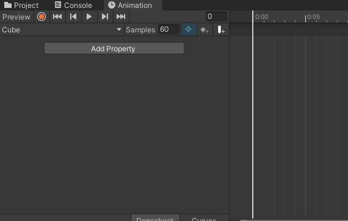
3. [Add Property]를 누르면 현재 오브젝트의 어떤 요소에 대한 타임라인을 설정할 것인지 고를 수 있다. 여기서는 큐브를 간단히 이동시킬 것이므로 Transform - Position을 선택한다.
> 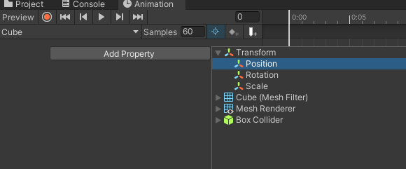
4. 오른쪽 타임라인을 보면 기본적으로 2개의 하얀 다이아몬드가 찍혀있는 것을 볼 수 있는데 우리는 이것을 Key라고 한다. 기본적으로 찍혀있는 2개의 Key는 오브젝트의 초기값을 가진다. 우리는 타임라인에 Cube 오브젝트의 Position을 올려놨기 때문에 2개의 Key에는 오브젝트의 초기 Position 값이 담겨있다.(0,0,0)
> 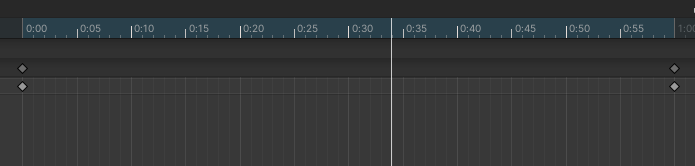
5. 타임라인과 Key가 의미하는 것은 애니메이션이 재생되고 특정 시간에는 해당 Key값이 되도록 오브젝트의 값을 조정하는 것이다.
6. 타임라인의 중간 지점을 찍고 큐브의 Position 값을 (10,0,0)으로 변경한 뒤 타임라인으로 돌아와서 'K'를 눌러서 Key를 찍어보자.
> 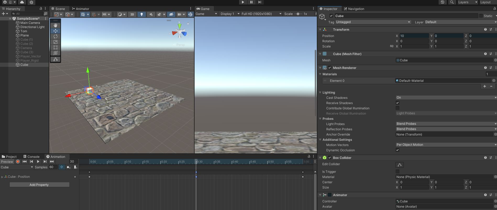
7. 이것이 의미하는 것은 애니메이션을 재생하면 확인할 수 있다. (애니메이션이 절반 재생되면 큐브가 10,0,0에 위치한다.)
8. 다른 애니메이션 클립을 생성하고 싶다면 애니메이션 창에서 하얀 삼각형 버튼을 눌러서 추가할 수 있다.
> 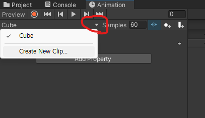

# ♾️ 애니메이션의 Loop 설정
기본적으로 애니메이션을 생성하면 Loop가 설정되어있다. 해당 Loop를 끄려면 애니메이션을 저장한 폴더로 이동하여 해당 애니메이션 클립의 Loop Time을 꺼준다.
> 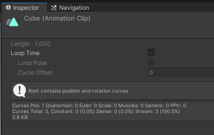

# ↕️ 애니메이션 순서 설정
하나의 오브젝트에 대해 여러개의 애니메이션 클립을 생성한 경우, 애니메이션이 어떤 순서로 재생되는지 설정하거나 어떤 조건을 만족할 때 재생할건지 설정이 필요합니다.
이런 설정은 Animator에서 할 수 있습니다.

1. [Window] - [Animation] - [Animator]을 클릭하여 Animator 창을 열어준다.
2. Animator에는 해당 오브젝트에 대해 생성한 애니메이션 클립들을 볼 수 있다.(Cube와 Cube2를 미리 만들어놓은 상태)
> 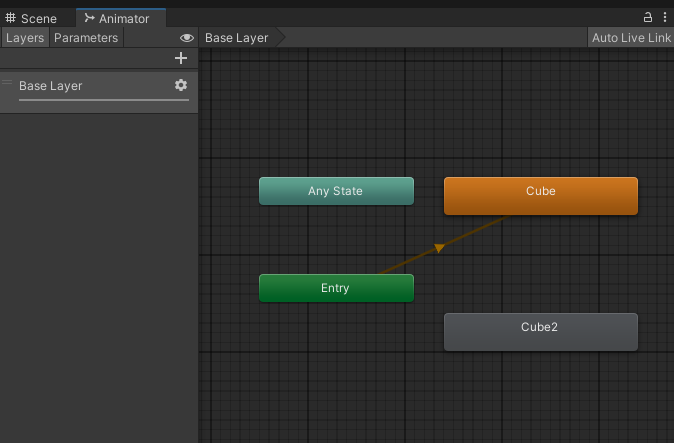
3. Entry에서 Cube로 이어져있는데 큐브의 애니메이션이 시작하면 바로 Cube 애니메이션 클립이 동작한다는 의미이다.
4. Cube를 우클릭하여 [Make Transition]을 누르면 Cube가 끝난 뒤 어느 애니메이션 클립으로 이동할 건지 설정할 수 있다. Cube2로 이어주자.
> 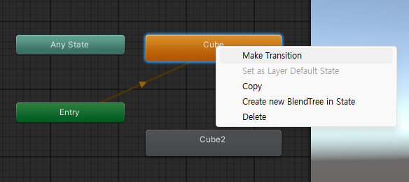
> 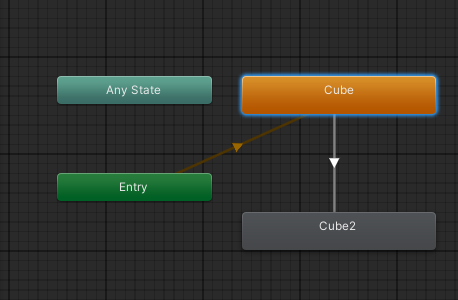
5. 게임을 실행해보면 Cube 애니메이션 실행 후에 Cube2 애니메이션이 실행 되는 것을 확인할 수 있다.

# ☑️ 애니메이션 재생 조건
위에서는 특정 조건없이 바로 Cube2 애니메이션으로 넘어갔지만 경우에 따라서는 특정 조건을 만족했을 때만 Cube2로 넘어가도록 만들어야 합니다.
이럴때는 Animator에서 Transition에 Condition을 설정해주면 됩니다.

아까 Cube와 Cube2 사이에 이어줬던 Transition을 눌러서 확인해보면 다음과 같이 넘어가는 조건(Condition)이 Empty인 것을 볼 수 있습니다.
> 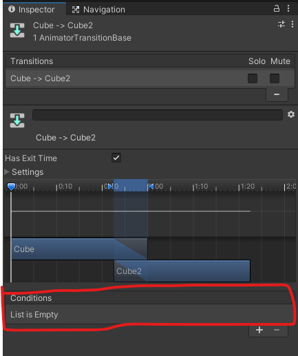

Condition에 특정 Parameter를 Condition으로 설정해주기 위해서는 아래의 과정을 거치게 됩니다.

1. Animator에서 Parameters를 누른다.
> 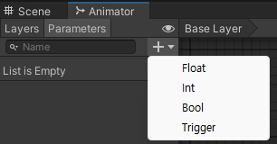
2. [+] 버튼을 눌러서 Parameter를 추가한다. (추후에 위쪽 방향키를 눌렀을 때 동작하도록 할 계획이므로 Up이라고 설정했습니다.)
> 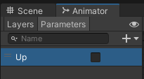
3. 다시 Transition을 눌러서 condition의 [+]버튼을 눌러 Up이 True일 때 넘어가도록 설정해줍니다.
> 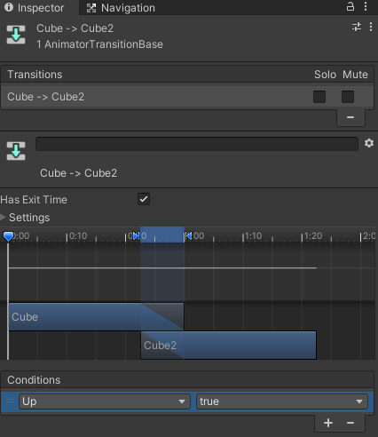

# 🗒️스크립트를 사용하여 애니메이션의 Parameter 설정하기
위에서 애니메이션 간 조건을 설정했고 이제 Up이라는 bool 변수가 true가 될 때만 Cube2 애니메이션 클립이 동작하도록 만들었습니다.
그럼 이제 Up이라는 bool 변수를 스크립트를 통해 true로 바꾸는 방법에 대해 설명하겠습니다.

> 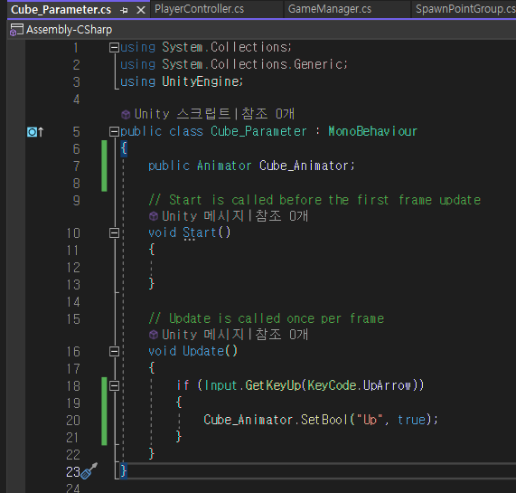

Line 7 : 먼저 Animator에 있는 Up 변수를 바꾸고 싶은 상황이므로 스크립트로 Animator를 받아와야 합니다.  
Line 20 : 그리고 Animator에 SetBool를 사용해서 특정 변수의 값을 변경하면 됩니다.

위 스크립트는 위쪽 화살표를 눌렀을 때 변경하도록 하였지만 각자 게임에 맞는 방식으로 변형하시면 됩니다.

# ⚠️ 주의사항

## 1. 시작 시 Cube 애니메이션 클립이 동작하지 않게 하는 방법
여러 방법이 있지만 그 중 가장 간단한 방법은 아무내용도 없는 State가 시작하자마자 동작하도록 설정하면 됩니다.

1. Animator의 빈 공간을 눌러서 [Create State] - [Empty]로 빈 State를 만듭니다.
> 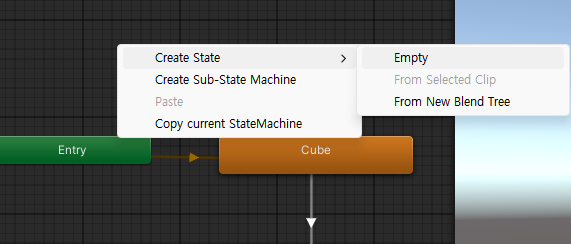
2. [Empty State 우클릭]-[Set as Layer Default State]를 통해 빈 State를 기본 State로 설정하시면 시작하자 마자 Empty State가 실행됩니다.
> 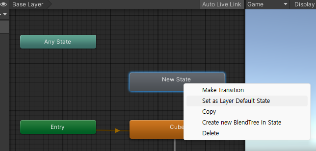
> 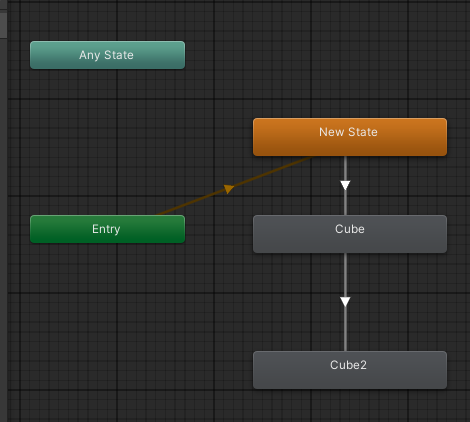
3. 이후 Cube를 실행하고 싶다면 위에서 Cube2에 조건을 걸었던 것 처럼 Empty와 CUbe를 잇고 시작할 때의 조건을 설정해주시면 됩니다.

---

