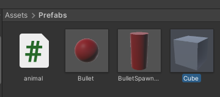
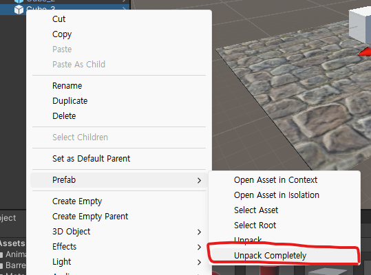
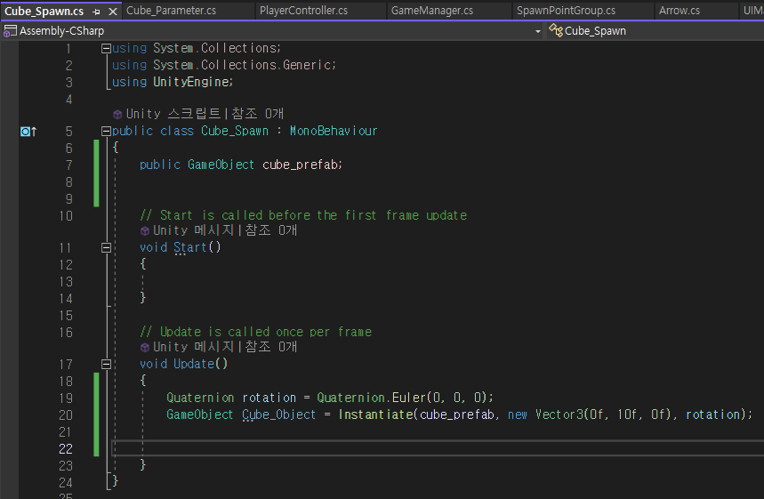
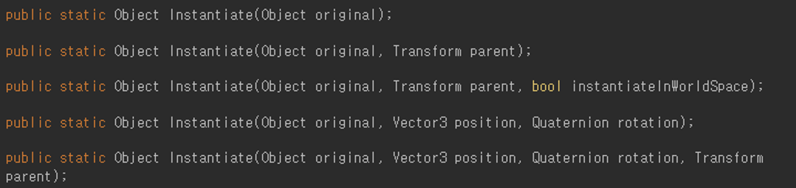

# 🏭Prefab이란🏭

---
작성자 : 19 김성우

<pre>
우리가 게임을 만들다보면 같은 오브젝트를 여러번 재활용하는 경우가 많습니다.  
예를 들어 플레이어 오브젝트는 맵이 바뀌더라도 계속해서 사용해야하는 오브젝트입니다.  
우리가 앞에서 Scene에 대해 배워서 알고있지만 Scene이 넘어가게되면 기본적으로는 기존에 있던 오브젝트들은 전부 사라지게 됩니다.  
그리고 새로운 Scene에서 작업했던 내용들을 모두 불러오게 됩니다.  
그렇다면 맵이 바뀔 때 마다 해당 맵에 플레이어 오브젝트를 매번 만들어줘야하는 걸까요? 
이런 문제를 해결하기 위해 유니티에서는 Prefab 기능을 제공하고 있습니다.  
Prefab이란 내가 작업했던 오브젝트를 통채로 저장하여 그룹화하는 기능입니다. 
여러번 사용해야하는 오브젝트를 딱 한번만 구현해놓는다면 Prefab화 시켜서 여러번 재사용할 수 있습니다.
</pre>

---

# 📓 Script Download

[1. 스크립트를 사용하여 오브젝트 생성하기]( https://github.com/starhome7/GG_Unity_GitHub/blob/main/Unity_Basic/7.Prefab%EC%9D%B4%EB%9E%80/Prefab_Script/Cube_Spawn.cs)

 

---

# 🧰 오브젝트 Prefab화 시키기
깃허브 페이지를 순서대로 보고있다면 아마 하이어라키에는 애니메이션을 적용했던 Cube 오브젝트가 있을것이고 이번 페이지에서는 해당 Cube를 가지고 설명할 예정입니다. 만약 순서대로 보고있지 않다면 하이어라키에 있는 아무 오브젝트나 사용해도 무방합니다.

1. 프로젝트 창에 Cube 오브젝트를 끌어다놓으면 Cube 오브젝트의 구성요소들이 하나로 묶여서 Prefab화 된다. (Asset - Prefab 폴더 만드는 것을 추천한다.)
> 
2. 끝

허무할정도로 간단하게 Prefab화를 시킬 수 있었다.
내가 필요한 오브젝트를 딱 한번만 구현한다면 이렇게 간단하게 Prefab화 시켜서 여러번 재사용할 수 있다.

# 🪞Prefab의 특징
Prefab으로 만든 Cube를 하이어라키 창으로 여러개 끌어다 놓으면 별다른 문제없이 Cube 여러개를 설치할 수 있습니다.
이때 프로젝트 창에서 Prefab 원본의 크기를 3배로 늘리면 맵에 있는 모든 Cube들의 크기가 3배가 되는 것을 볼 수 있습니다.
우리가 맵에 가져다놓은 오브젝트들은 Prefab 원본의 값들을 그대로 가져다쓰는 오브젝트들이기 때문입니다.
이러한 특징 덕분에 우리는 Prefab 원본 하나만 수정해도 맵에 있는 모든 오브젝트들을 한번에 수정할 수 있습니다.

# 📤Prefab 해제하기
위에서 봤듯이 우리는 Prefab 원본을 수정해서 모든 오브젝트를 한번에 수정할 수 있었습니다. 하지만 경우에 따라서 Prefab 원본과는 독립적으로 관리하고 싶은 오브젝트가 있을 수도 있습니다. 이럴때는 특정 오브젝트를 Unpack하여 Prefab을 해제시켜주면 됩니다.
> 

# ♾️ 스크립트를 사용하여 오브젝트 생성하기
이번에는 스크립트를 통해 Prefab으로 만들어 놓은 Cube를 맵에 생성하는 과정에 대해 알아보겠습니다.
> 

Line 7 : 먼저 Prefab으로 만든 Cube 오브젝트를 생성하고 싶은 상황이므로 스크립트로 GameObject를 받아와야 합니다.  
Line 20 : 그리고 Instantiate 함수를 사용하여 GameObject를 생성하면 됩니다.

# 🏭 Instantiate 함수
Instantiate 함수는 특정 게임 오브젝트를 복사하여 Scene에 생성하는 합수입니다.
Instantiate는 아래 4가지 방법으로 사용할 수 있습니다.
> 

# ⚠️ 주의사항

## 1. Cube가 미친듯이 생성되고 있어요
Update문 안에 있는 내용은 매 프레임마다 호출되게 됩니다. Prefab이 생성되는 것을 보여주기 위해 단순히 Update문에 
코드를 작성했기 때문인데 나중에 Invoke나 If 문등을 사용하여 특정 조건에만 생성되도록 조절하시면 됩니다.

---

