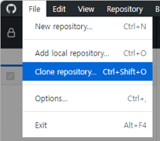
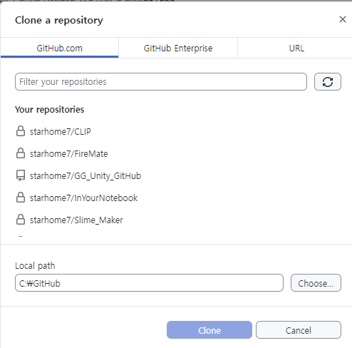
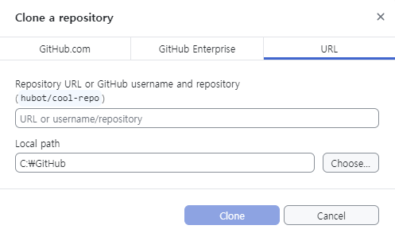
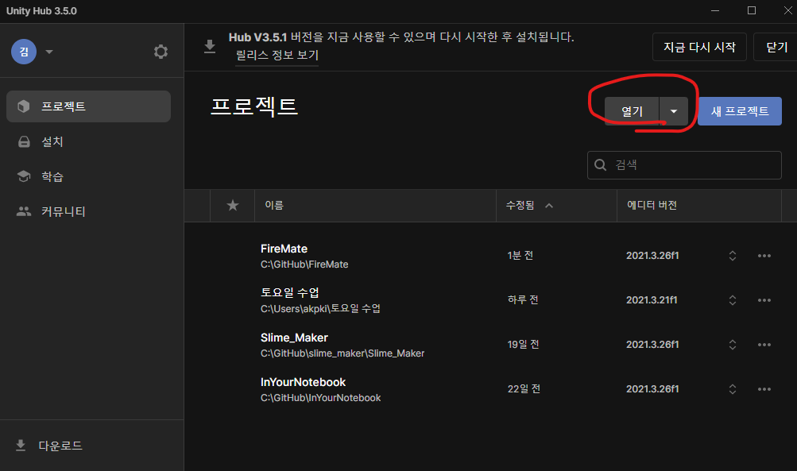
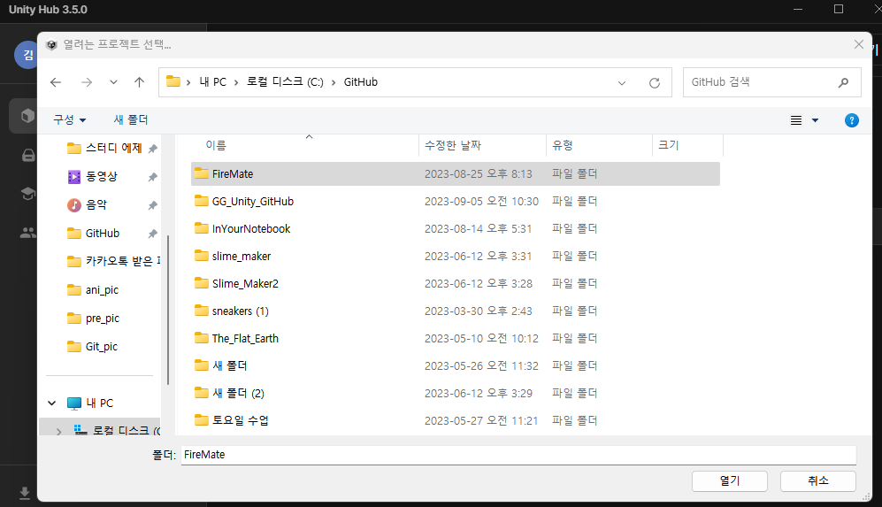
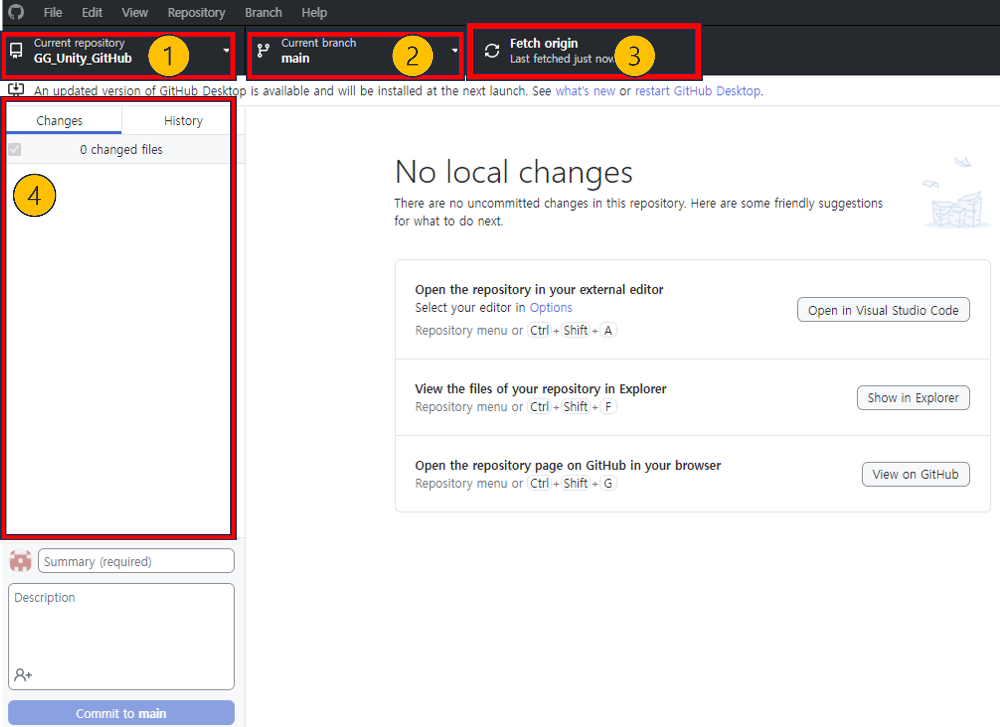
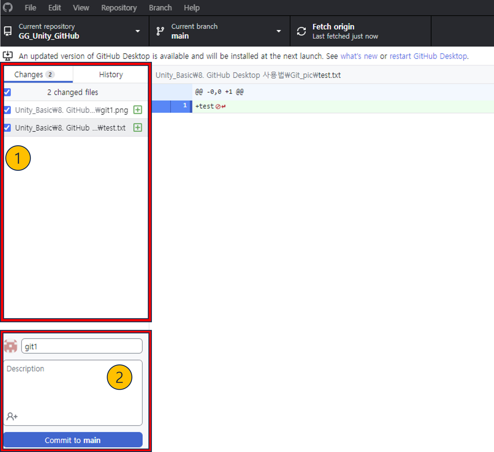
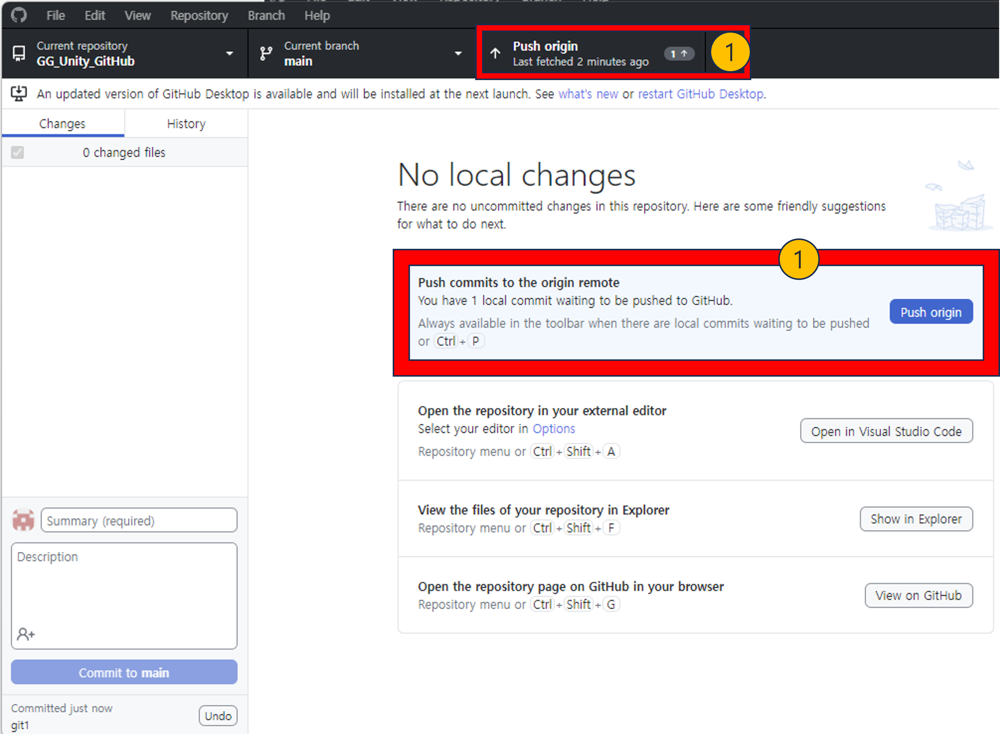

# 🖥️애니메이션이란🖥️

---
작성자 : 19 김성우

<pre>
오늘은 동아리 질문 1위에 빛나는 GitHub Desktop 사용법에 대해 설명하려고 합니다. 
GitHub Desktop은 GitHub에 파일을 업로드 해주는 프로그램으로 GitHub에서 직접 파일을 업로드해도 무방합니다. 
사람마다 차이는 있겠지만 GitHub Desktop을 사용하는 것이 보기도 편하고 사용법도 어렵지 않기때문에 사용하는 것을 추천드립니다. 
GitHub나 GitHub Desktop을 사용하지 않고 팀 프로젝트르 하면 작업한 프로젝트 자체를 Export하여 공유하거나 
압축하여 공유해야하는데 이 방식은 매우 귀찮을뿐더러 여러사람이 동시에 작업할 수도 없습니다.(경험담입니다.) 
따라서 앞으로 GitHub와 친해질 수 있도록 합시다. 그리고 그 방법 중 가장 좋은 것은 자주, 많이 쓰는 것 밖에는 없는 것 같습니다.  
아래에 설명할 내용들은 작성자 본인이 Git / GitHub에 대해 이해한 방식으로 설명하고 있기 때문에 실제와는 차이가 있을 수 있습니다.

</pre>

---

# 💻 GitHub란
깃허브를 아주 간단히 설명하자면 Git History들을 보관하는 클라우드 서버입니다.
Git History란 특정 파일에 대해 변화가 생길 때 마다 기록해놓은 데이터를 의미합니다. 즉, 과거에 어떤 상태였는지도 기록되어 있기 때문에 작업을 하다가 파일에 큰 오류가 생기더라도 과거의 데이터로 복구할 수 있습니다. 반대로 내 컴퓨터에 있는 파일이 과거 버전에 머물러있더라도 GitHub에서 최신 History를 가져와서 적용시키면 최신화 시킬 수 있습니다. 이러한 특징들 덕분에 팀 프로젝트에 유용하게 사용할 수 있습니다. GitHub를 통한 팀 프로젝트는 아래의 과정으로 이루어집니다.

게임에 필요한 오브젝트가 10개, 팀원이 10명이라고 가정합니다.

1. 팀원마다 오브젝트 1개씩을 담당합니다.
2. 내가 맡은 오브젝트를 작업한 뒤 GitHub에 업로드합니다.
3. 다른 팀원들이 작업한 9개의 오브젝트에 대해서는 GitHub에 업로드 되어있는 정보를 읽어와서 적용시킵니다.
4. 게임에 필요한 오브젝트 10개가 완성됩니다. 

간략하게 설명한 것으로 정확한 설명은 아님을 알려드립니다.

---

# 🚶 GitHub Desktop 시작하기
GitHub에서 관리하는 공간 하나를 repository(리포지토리)라고 합니다. 관리하고자 하는 파일들의 최상위 폴더로 이해해도 무방합니다.
GitHub Desktop을 시작하려면 일단 repository를 내 컴퓨터로 복사해와야 합니다. 이 과정을 Clone Repository라고 합니다.
repository를 내 컴퓨터로 복사해오는 이유는 너무 당연하게도 서버에 저장되어있는 파일들을 내 컴퓨터로 받아오기 위함입니다.
과정은 아래와 같습니다.

1. [File] - [Clone repository]를 눌러서 어떤 repository를 복사해올것인지 선택합니다.
> 
2. [GitHub.com] : 로그인되어있는 아이디가 이미 들어가있는 repository 목록입니다.
> 
3. [URL] : 특정 repository의 url를 입력하여 해당 repository를 가져옵니다.
> 
4. 유니티 허브에서 [Open]을 누른 뒤 리포지토리를 받아온 경로로 이동하여 프로젝트를 엽니다.
> 
> 

리포지토리를 내 컴퓨터로 복사해왔다면 이제 내 컴퓨터에서 작업할 준비는 끝났습니다.

---
# ❓GitHub Desktop 구성요소
> 

1. 현재 어떤 리포지토리에서 작업중인지 표시합니다.
2. 현재 어떤 branch에서 작업중인지 표시합니다. branch에 대해서는 아래에서 자세히 설명합니다.
3. Origin의 내용을 새로고침합니다. Origin은 서버의 내용을 의미합니다.
4. Local에서 변화한 내용들을 표시합니다. Local은 내 컴퓨터의 내용을 의미합니다.

---
# 📦 GitHub Desktop을 사용하여 작업한 내용을 업로드하기
내 컴퓨터에서 작업을 한 뒤 서버에 업로드 하는 방법에 대해 알아보겠습니다.
만약 나 혼자 진행하는 프로젝트라면 서버에 파일을 업로드해주지 않아도 되지만 팀 프로젝트를 진행하고 있다면 파일을 자주 업로드해주는 편이 좋습니다.
다른 사람들과 나의 버전이 많이 차이나게 되면 나중에 서로의 파일을 합치는 과정에서 치명적인 오류가 발생할 수 있습니다.
따라서 내가 어느정도 작업을 한 후에는 서버에 업로드 해주는 것을 생활화 합시다.

내가 작업한 뒤 Origin(서버)에서 Pull(다운로드)한 파일과 달라진 부분이 있다면 변경된 점을 Commit(포장)하여 Push(업로드)할 수 있습니다.
GitHub Desktop은 이 3가지 방식으로 동작함을 이해하면 됩니다.
Pull(서버에서 받아온다) - Commit(변경된 파일을 포장한다) - Push(포장한 것을 서버로 업로드한다)

내가 어떤 작업을 해서 변경사항이 생기면 아래와 같은 화면을 볼 수 있습니다.
> 
1. 서버와 비교했을 때 변경된 파일들의 목록입니다. 여기서 업로드하길 원하는 것들만 선택할 수 있습니다.
2. 선택한 변경점들을 Commit(포장)합니다.

Commit을 완료하면 아래와 같은 면을 볼 수 있습니다.
> 
1. 포장해놓은 변경점들을 서버로 Push(업로드) 합니다.

# ↕️ 애니메이션 순서 설정
하나의 오브젝트에 대해 여러개의 애니메이션 클립을 생성한 경우, 애니메이션이 어떤 순서로 재생되는지 설정하거나 어떤 조건을 만족할 때 재생할건지 설정이 필요합니다.
이런 설정은 Animator에서 할 수 있습니다.

1. [Window] - [Animation] - [Animator]을 클릭하여 Animator 창을 열어준다.
2. Animator에는 해당 오브젝트에 대해 생성한 애니메이션 클립들을 볼 수 있다.(Cube와 Cube2를 미리 만들어놓은 상태)
> 
3. Entry에서 Cube로 이어져있는데 큐브의 애니메이션이 시작하면 바로 Cube 애니메이션 클립이 동작한다는 의미이다.
4. Cube를 우클릭하여 [Make Transition]을 누르면 Cube가 끝난 뒤 어느 애니메이션 클립으로 이동할 건지 설정할 수 있다. Cube2로 이어주자.
> 
> 
5. 게임을 실행해보면 Cube 애니메이션 실행 후에 Cube2 애니메이션이 실행 되는 것을 확인할 수 있다.

# ☑️ 애니메이션 재생 조건
위에서는 특정 조건없이 바로 Cube2 애니메이션으로 넘어갔지만 경우에 따라서는 특정 조건을 만족했을 때만 Cube2로 넘어가도록 만들어야 합니다.
이럴때는 Animator에서 Transition에 Condition을 설정해주면 됩니다.

아까 Cube와 Cube2 사이에 이어줬던 Transition을 눌러서 확인해보면 다음과 같이 넘어가는 조건(Condition)이 Empty인 것을 볼 수 있습니다.
> 

Condition에 특정 Parameter를 Condition으로 설정해주기 위해서는 아래의 과정을 거치게 됩니다.

1. Animator에서 Parameters를 누른다.
> 
2. [+] 버튼을 눌러서 Parameter를 추가한다. (추후에 위쪽 방향키를 눌렀을 때 동작하도록 할 계획이므로 Up이라고 설정했습니다.)
> 
3. 다시 Transition을 눌러서 condition의 [+]버튼을 눌러 Up이 True일 때 넘어가도록 설정해줍니다.
> 

# 🗒️스크립트를 사용하여 애니메이션의 Parameter 설정하기
위에서 애니메이션 간 조건을 설정했고 이제 Up이라는 bool 변수가 true가 될 때만 Cube2 애니메이션 클립이 동작하도록 만들었습니다.
그럼 이제 Up이라는 bool 변수를 스크립트를 통해 true로 바꾸는 방법에 대해 설명하겠습니다.

> 

Line 7 : 먼저 Animator에 있는 Up 변수를 바꾸고 싶은 상황이므로 스크립트로 Animator를 받아와야 합니다.  
Line 20 : 그리고 Animator에 SetBool를 사용해서 특정 변수의 값을 변경하면 됩니다.

위 스크립트는 위쪽 화살표를 눌렀을 때 변경하도록 하였지만 각자 게임에 맞는 방식으로 변형하시면 됩니다.

# ⚠️ 주의사항

## 1. 시작 시 Cube 애니메이션 클립이 동작하지 않게 하는 방법
여러 방법이 있지만 그 중 가장 간단한 방법은 아무내용도 없는 State가 시작하자마자 동작하도록 설정하면 됩니다.

1. Animator의 빈 공간을 눌러서 [Create State] - [Empty]로 빈 State를 만듭니다.
> 
2. [Empty State 우클릭]-[Set as Layer Default State]를 통해 빈 State를 기본 State로 설정하시면 시작하자 마자 Empty State가 실행됩니다.
> 
> 
3. 이후 Cube를 실행하고 싶다면 위에서 Cube2에 조건을 걸었던 것 처럼 Empty와 CUbe를 잇고 시작할 때의 조건을 설정해주시면 됩니다.

---

