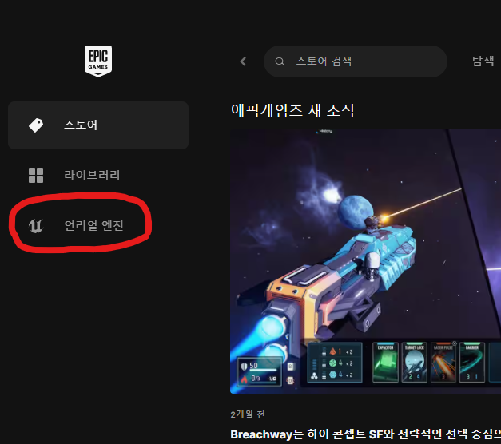
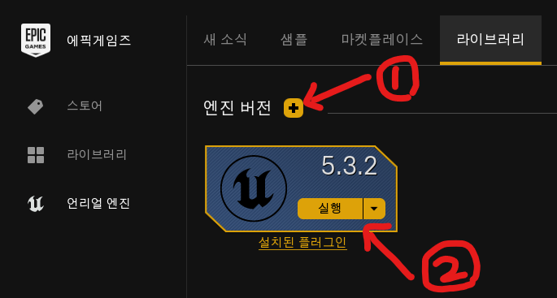

# :raccoon:시작해요 언리얼엔진🌳

---
작성자 : 19 김성우

<pre>
언리얼 엔진에 관한 정보들을 정리하기에 앞서서 언리얼 엔진 설치 방법에 대한 글을 작성합니다.
작성자 본인은 Windows 이외의 OS를 사용한 적이 없어서 MAC 또는 기타 OS 환경에서의 설치방법은 알지 못하니 아시는 분이 계시다면 수정바랍니다.
</pre>

---

## 1. Epic Games 런처 설치
https://www.unrealengine.com/ko/

## 2. Epic Games 런처 내의 언리얼 엔진 섹션 클릭
>  

## 3. 원하는 버전의 엔진 설치
> 강의는 5.3.2버전을 기준으로 진행됩니다.
> 작성자는 이미 엔진을 설치한 후라서 실행으로 나오지만 설치 전에는 설치 버튼이 있을 겁니다.
> 

---

# 📆앞으로의 계획
> 강의는 하나의 간단한 게임을 만드는 방향으로 진행되며 중간중간에 나오는 중요 개념들에 대해서 설명하고 넘어가는 방식으로 진행됩니다.

