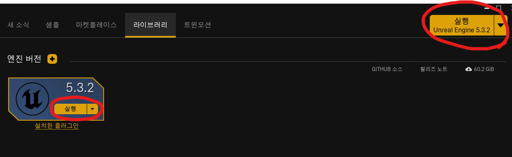
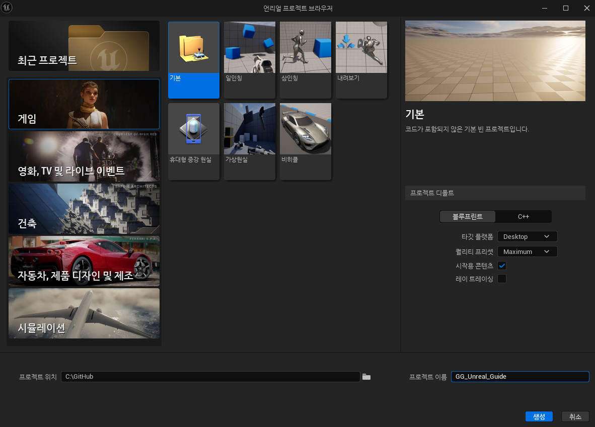

# :raccoon:시작해요 언리얼엔진🌳

---
작성자 : 19 김성우

<pre>
앞으로의 강의는 하나의 간단한 게임을 만들면서 진행됩니다.
중요한 개념이 나올 때 마다 설명을 하고 넘어가며, 강의의 제목으로 구분해 놓을 예정입니다.
</pre>

---
## 1. Epic Games 런처 내의 언리얼 엔진 실행 클릭
>  

## 2. 프로젝트 생성 
> 강의는 5.3.2버전을 기준, 기본 프로젝트에 시작용 콘텐츠를 포함한 상태로 시작합니다.
> 

---

