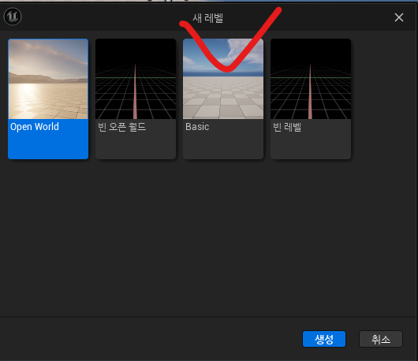
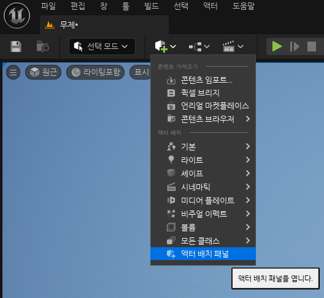
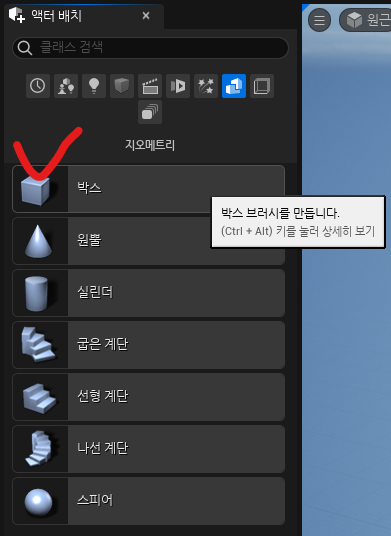
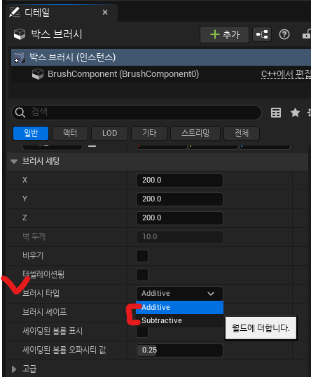
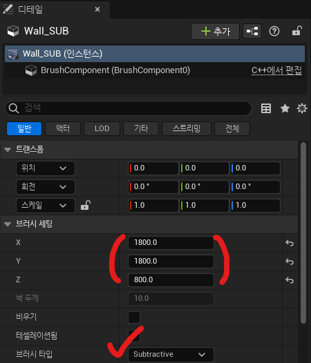

# :raccoon:시작해요 언리얼엔진🌳

---
# [3.레벨 생성 및 지오메트리 브러쉬]
작성자 : 19 김성우

<pre>
이번 시간에는 간단한 게임을 제작할 레벨(유니티에서의 Scene)을 만드는 방법과 지오메트리를
구성하는 방법에 대해 설명하고자 합니다.
</pre>

---
## 1. 새로운 레벨 생성
>  
>> 처음 프로젝트를 만들고 나면 위와 같은 화면이 보일겁니다. 언리얼 엔진에서 제공하는 기본 레벨(씬)인데 우리는 아무것도 없는 레벨을 생성하고 그 레벨에서 게임의 기초가 될 공간을 만들어보겠습니다.

>  
>  
> > [파일]-[새 레벨](단축키 : 컨트롤 + N)을 눌러서 새로운 레벨을 생성할 수 있습니다. 이번 강의에서는 아무것도 없는 레벨에서 시작할 계획이므로 Basic으로 만든 뒤 Floor 액터를 삭제해 줍니다. 

## 2. 지오메트리 추가하기
>  
>  
>  
> > 큐브와 플러스가 그려진 아이콘을 눌러서 액터 배치 패널을 켜 준 뒤, 지오메트리를 누르고 박스 지오메트리를 드래그해 맵에 추가해 줍니다.
> > 오른쪽 디테일 창에서 추가한 박스 지오메트리의 위치 값을 (0,0,0)으로 설정해 줍니다.

## 3. 지오메트리 브러쉬를 사용하여 맵 만들기
>  
> > ※ 지오메트리 브러쉬는 BSP라는 알고리즘을 사용하는데 그것에 대해 자세히 다루지는 않습니다.
> >  위 사진과 같이 지오메트리 브러쉬는 더하는 영역(Additive)과 빼는 영역(Subtractive)을 설정할 수 있습니다.
> >  말 그대로 설정한 영역에 박스 지오메트리를 더할 것인지 혹은 뺄 것인지 고르는 것입니다.
> >  예를 들어 언리얼 엔진에서 정육면체의 맵을 만들고자 할 때 2가지 방법으로 만들 수 있습니다.
> >  첫번째 방법은 더하는 영역만 사용하는 경우로 내가 만들고자 하는 맵의 6면을 각각 만들어서 하나로 붙이는 방법입니다.
> >  두번째 방법은 더하는 영역과 빼는 영역을 둘 다 사용하는 것으로 속이 채워진 정육면체를 하나 만들고 그 안의 공간을 빼버리는 방법입니다.
> >  결론만 말하자면 두 방법 모두 복잡한 맵을 만들때보다는 간단한 맵 또는 프로토타입을 만들 때 추천합니다. 복잡한 맵을 만들고자 할 때는 3D MAX나 마야같은 외부 툴을 사용하는 것이 좋습니다.
> > 강의에서는 두번째 방법을 사용하여 네모난 맵을 만들어 보겠습니다.

>  
> > 먼저 아까 만들어둔 지오메트리 브러쉬 액터를 복사하여 더하기로 사용할 하나는 Wall_ADD, 빼기로 사용할 나머지 하나는 Wall_SUB로 이름을 바꾸어줍니다. 작성자는 편의를 위해 Wall 폴더를 만들어서 구분해 두었습니다.

>  
>  
>   그 후 Wall_ADD의 브러시 세팅의 x,y,z를 각각 2000,2000,1000으로 바꾸고 Wall_SUB는 200씩 작은 값인 1800,1800,800으로 변경해줍니다. 이때 브러시 자체의 Scale값을 바꾸지 않도록 조심합니다.
>   값을 저렇게 설정하면 아래 사진과 같이 내부가 파인 모습의 지오메트리가 생성됩니다.
>  

## 4. 레벨 저장하고 시작 레벨로 지정하기
>  
> > 방금 만든 레벨을 원하는 경로에 저장해 줍니다. 작성자는 Maps 폴더에 레벨을 모아둘 계획이므로 Maps폴더에 MainLevel이라는 이름으로 저장했습니다.
>  
>  
> > 다음에 프로젝트를 열었을 때도 방금 만든 레벨이 실행될 수 있도록 기본 레벨로 설정하도록 합니다.
> > 오른쪽 위에 세팅 버튼을 누른 뒤 [프로젝트 세팅]-[맵&모드]로 이동하여 "에디터 시작 맵"과 "게임 기본 맵"을 MainLevel 맵으로 지정해줍니다.

---
## ⚠️참고할 점
> 1. 언리얼에서의 크기 값 1은 1cm을 의미합니다. 즉 지금 만든 공간은 20m,20m,10m의 직육면체입니다.
> 2. 지오메트리 브러쉬의 Scale 값을 직접 변경하지 않는 이유는 지오메트리 브러쉬 마다 Scale값이 다르면 브러시 세팅이 같아도 그 비율만큼 오차가 생기기 때문입니다.
> 3. Wall_SUB이 200씩 작은 이유는 Wall_ADD에서 Wall_SUB만큼의 공간을 빼내는 방식이기 때문입니다.

