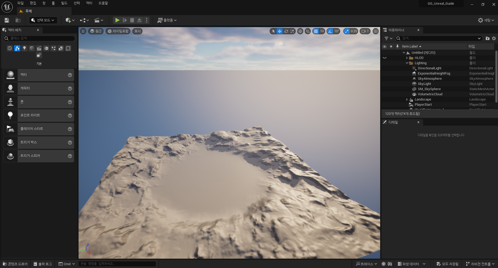
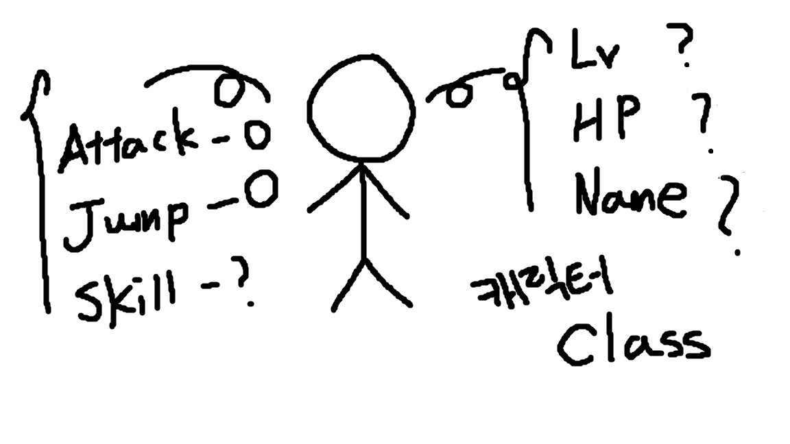
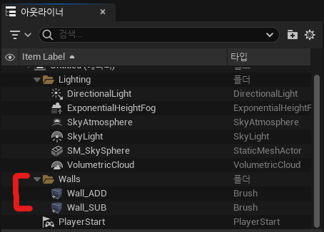

# :raccoon:시작해요 언리얼엔진🌳

---

# [4.오브젝트,액터 그리고 폰]
작성자 : 19 김성우

<pre>
이번 시간에는 언리얼 엔진에서 계속 마주치게 될 오브젝트, 액터 그리고 폰에 대해 설명해보겠습니다.
객체지향 프로그래밍의 개념까지 같이 설명할 계획인데 설명을 쉽게하기 위해 든 예시에는 약간의 비약이 있을 수 있으니 작성자가 말하고자하는 의도만 파악해주시면 감사하겠습니다.
</pre>

---
  
## 1.오브젝트
> 전공자인 여러분들에게 오브젝트라는 개념은 사실 생소한 개념이 아닙니다.(아마도?) 우리는 객체지향프로그래밍 수업 때 JAVA를 배우면서 객체지향이라는 개념을 배웠습니다.
> 여러분들이 자주쓰는 Python 그리고 언리얼에서 사용되는 C++에서도 객체지향 프로그래밍을 하는데 이때 사용되는 개념이 객체, 즉 Object입니다.
> 오브젝트라는 건 어떠한 구조가 정해져 있는 것은 아닙니다. 단지 우리가 만들고자 하는 무언가를 함수와 변수(data)들로 표현한 것을 의미합니다.
> 예를 들어, 게임에서 사용할 캐릭터 오브젝트를 하나 만든다고 가정해봅시다. 캐릭터는 레벨, HP, 이름등의 변수들이 내부적으로 필요할 것이고
> 공격, 점프, 스킬 등과 같은 동작들을 수행해 줄 함수들도 만들어야 할 것입니다. 이런 변수들과 함수들이 모여서 다음과 같이 하나의 '캐릭터'라는 오브젝트를 만들게 되는 것이죠.
>>  
> 여러분이 이렇게 캐릭터 하나를 만들고 나니 문제가 발생했습니다. 팀장이 캐릭터 1천개를 만들어오라고 하네요. 어떻게 해야할까요? 같은 방법으로 오브젝트를 일일이 1천번 만들어야할까요? 아님 1천번 복사?

## 2.클래스
>위와 같은 상황을 해결해 줄 수 있는 방법이 바로 클래스 입니다. 클래스는 우리가 만들고자하는 오브젝트의 틀을 의미합니다.
> 게임에서 사용할 '캐릭터' 오브젝트들이 가지는 공통적인 특징들을 묶어서 틀로 만든 후 캐릭터을 찍어내면 됩니다.
> 예를 들어, '캐릭터' 오브젝트들은 공통적으로 Level, HP, Name 변수를 가지고 있고 Attack, Jump, Skill 행동을 수행하는 함수를 필요로 합니다.
>>  
>   이렇게 틀을 잡아놓은 뒤 그 캐릭터가 마법사인지 전사인지 도적인지에 따라 각자 다른 값만 넣어주면 하나의 클래스로 여러개의 오브젝트를 생성할 수 있게됩니다.
>>  

## 3.인스턴스
>> 인스턴스는 클래스로 부터 생성된 복제본을 의미합니다. 아까 우리가 만든 여러 캐릭터 오브젝트들이 모두 '캐릭터'클래스의 인스턴스가 되는 것이죠.
>> 오브젝트를 만들 때 메모리 상에 구현된 소프트웨어 상의 오브젝트라고 이해하면 됩니다. 오브젝트와 인스턴스는 엄밀히 물리적이냐 소프트웨어적이냐의 차이가 있고 다른 것이지만 흔히 오브젝트와 인스턴스는 혼용해서 사용됩니다. 

## 4.인스턴스 
> > 지금까지는 객체지향 프로그래밍에 대한 내용이였습니다. 여기까지 잘 따라온 성우 학생은 자신감에 가득차 언리얼 엔진을 실행합니다. 그런데 이게 웬걸 
> >  위 사진과 같이 지오메트리 브러쉬는 더하는 영역(Additive)과 빼는 영역(Subtractive)을 설정할 수 있습니다.
> >  말 그대로 설정한 영역에 박스 지오메트리를 더할 것인지 혹은 뺄 것인지 고르는 것입니다.
> >  예를 들어 언리얼 엔진에서 정육면체의 맵을 만들고자 할 때 2가지 방법으로 만들 수 있습니다.
> >  첫번째 방법은 더하는 영역만 사용하는 경우로 내가 만들고자 하는 맵의 6면을 각각 만들어서 하나로 붙이는 방법입니다.
> >  두번째 방법은 더하는 영역과 빼는 영역을 둘 다 사용하는 것으로 속이 채워진 정육면체를 하나 만들고 그 안의 공간을 빼버리는 방법입니다.
> >  결론만 말하자면 두 방법 모두 복잡한 맵을 만들때보다는 간단한 맵 또는 프로토타입을 만들 때 추천합니다. 복잡한 맵을 만들고자 할 때는 3D MAX나 마야같은 외부 툴을 사용하는 것이 좋습니다.
> > 강의에서는 두번째 방법을 사용하여 네모난 맵을 만들어 보겠습니다.

>  
> > 먼저 아까 만들어둔 지오메트리 브러쉬 액터를 복사하여 더하기로 사용할 하나는 Wall_ADD, 빼기로 사용할 나머지 하나는 Wall_SUB로 이름을 바꾸어줍니다. 작성자는 편의를 위해 Wall 폴더를 만들어서 구분해 두었습니다.

>  
>  
>   그 후 Wall_ADD의 브러시 세팅의 x,y,z를 각각 2000,2000,1000으로 바꾸고 Wall_SUB는 200씩 작은 값인 1800,1800,800으로 변경해줍니다. 이때 브러시 자체의 Scale값을 바꾸지 않도록 조심합니다.
>   값을 저렇게 설정하면 아래 사진과 같이 내부가 파인 모습의 지오메트리가 생성됩니다.
>  

## 4. 레벨 저장하고 시작 레벨로 지정하기
>  
> > 방금 만든 레벨을 원하는 경로에 저장해 줍니다. 작성자는 Maps 폴더에 레벨을 모아둘 계획이므로 Maps폴더에 MainLevel이라는 이름으로 저장했습니다.
>  
>  
> > 다음에 프로젝트를 열었을 때도 방금 만든 레벨이 실행될 수 있도록 기본 레벨로 설정하도록 합니다.
> > 오른쪽 위에 세팅 버튼을 누른 뒤 [프로젝트 세팅]-[맵&모드]로 이동하여 "에디터 시작 맵"과 "게임 기본 맵"을 MainLevel 맵으로 지정해줍니다.

---
## ⚠️참고할 점
> 1. 언리얼에서의 크기 값 1은 1cm을 의미합니다. 즉 지금 만든 공간은 20m,20m,10m의 직육면체입니다.
> 2. 지오메트리 브러쉬의 Scale 값을 직접 변경하지 않는 이유는 지오메트리 브러쉬 마다 Scale값이 다르면 브러시 세팅이 같아도 그 비율만큼 오차가 생기기 때문입니다.
> 3. Wall_SUB이 200씩 작은 이유는 Wall_ADD에서 Wall_SUB만큼의 공간을 빼내는 방식이기 때문입니다.

