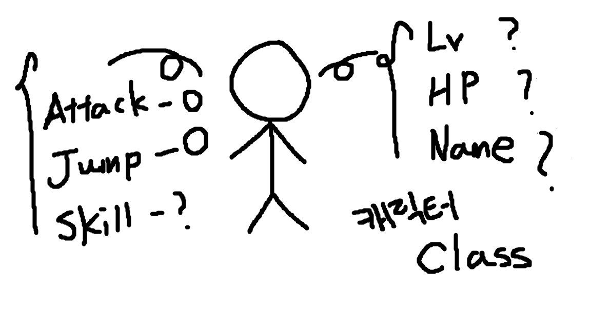
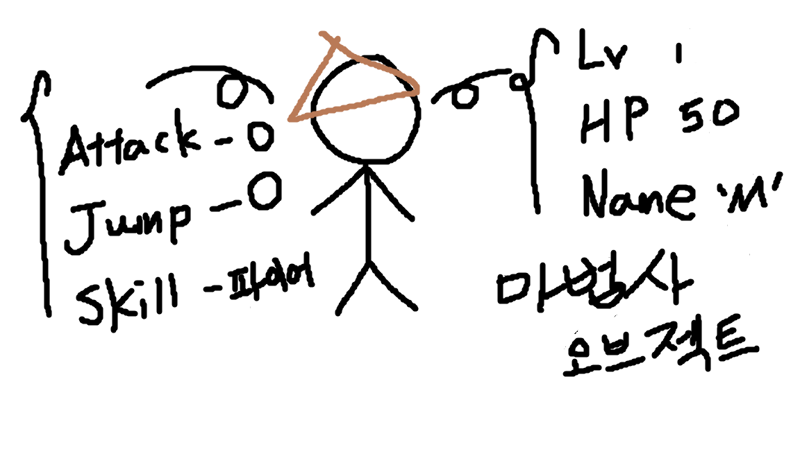
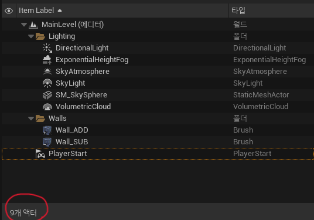
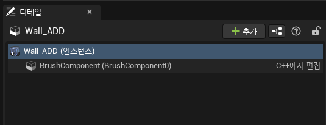

# :raccoon:시작해요 언리얼엔진🌳

---

# [5.피직스 시뮬레이션 & 블루프린트 클래스]
작성자 : 19 김성우

<pre>
앞으로 만들어 볼 게임은 간단한 슈팅게임으로 떨어지는 큐브를 타이밍에 맞추어 쏴서 창문 밖으로 밀어내는 게임입니다.
이번 시간에는 큐브 액터에 물리법칙을 적용시키기 위해 피직스 시뮬레이션에 대해 알아보고 총알을 블루프린트 클래스로 만들어 보겠습니다.
</pre>

---
  
## 1.큐브 액터 생성
>>  
>>  
>
> [빠른 배치]-[셰이프]-[큐브]로 위와 같이 한쪽 벽면에 큐브를 적당히 배치해줍니다.
> 배치한 후 플레이 버튼을 눌러서 큐브의 움직임을 확인해 봅시다.
> 큐브는 떨어지지 않은 채 공중에 떠 있을 겁니다. 그럼 이제부터는 피직스 시뮬레이션을 통해 이 큐브가 물리법칙을 받을 수 있도록 해봅시다.

## 2.피직스 시뮬레이션
>>  
>  아웃라이너에서 방금 생성한 큐브를 선택한 뒤 디테일 창을 통해 피직스 탭으로 이동해 줍니다.
> 그 중에서 가장 위에 있는 피직스 시뮬레이트 프로퍼티를 체크해주면 이제 이 큐브에 물리 법칙이 작용되게 됩니다.
> 플레이 버튼을 눌러보면 이제 큐브에 중력이 작용하여 아래로 떨어지는 것을 확인할 수 있습니다.
> 만약 중력을 작용하고 싶지 않은 물체라면 피직스 탭에서 중력 활성화를 체크 해제해주시면 됩니다.

## 3.블루프린트 클래스
> 떨어지는 큐브는 위에서 완성했으니 이제는 총알을 구현해보도록 하겠습니다.
> 먼저 아까와 마찬가지로 액터 배치도구를 사용하여 구체(스피어)를 하나 생성해줍니다.
> 우리가 저번 시간에 배웠듯이 똑같은 오브젝트를 여러개 만들고 싶다면 클래스를 통해 해결할 수 있다고 배웠습니다. 총알도 게임 내에서 여러번 생성해야 하므로 블루프린트 클래스로 변환하도록 하겠습니다.
>    우리가 배울 블루프린트 클래스도 클래스의 일종으로 흔히 블루프린트라고 부릅니다. 시각적인 방식(블럭 코딩같은 방식)으로 여러 함수를 추가하여 새로운 클래스 또는 액터를 정의합니다.
> 쉽게 말해서 유니티의 프리팹을 만드는 과정이라고 이해하시면 편할 것 같습니다.
>   
>> 
> 위와 같이 방금 생성한 구체의 디테일 창 우측에 있는 블루프린트 변환 버튼을 통해 구체를 블루프린트 클래스로 변환해 줍니다.
>>    
>   그럼 다음과 같은 창이 나오게 되는데 '새 서브클래스'를 선택하고 저장할 경로를 설정한 뒤 Bullet이라는 이름으로 생성해 줍니다.
>>    
>   이 Bullet 클래스는 총알로서 역할을 할 것이기 때문에 머테리얼을 총알 느낌이 나도록 바꿔주고 피직스 옵션을 체크해줍니다.
>    다시 맵으로 돌아가서 왼쪽 하단에 있는 콘텐츠 드로어를 누르고 Bullet 클래스를 저장한 경로로 가면 방금 만든 Bullet 클래스를 확인할 수 있습니다.
> 이 클래스를 끌어다가 맵에 놓으면 우리가 만든 Bullet 액터를 언제든지 맵에 추가할 수 있습니다.

---
## 다음 시간에 할 내용
> 오늘은 피직스 시뮬레이션을 통해 액터에 물리 법칙을 적용하고 블루프린트 클래스를 사용하여 총알 액터를 만들어 보았습니다.
> 다음 시간에는 총알이 날아갈 수 있도록하고 클릭할 때 총알이 발사되도록 하는 내용으로 진행하도록 하겠습니다.

