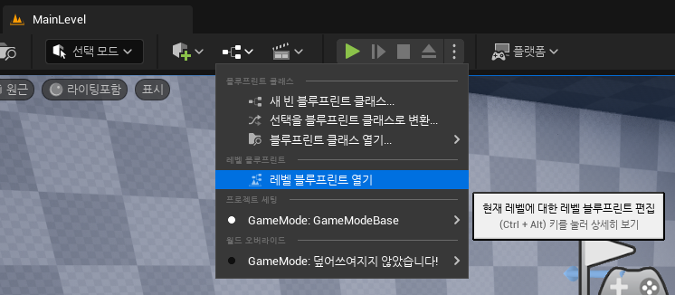
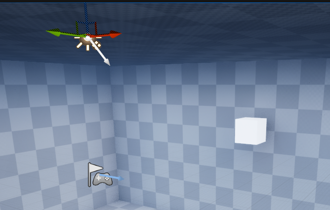
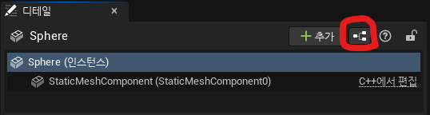

# :raccoon:시작해요 언리얼엔진🌳

---

# [6.블루프린트 & 노드와 핀 & 임펄스]
작성자 : 19 김성우

<pre>
오늘은 블루프린트를 활용하여 총알이 날아갈 수 있도록하고 클릭할 때 총알이 발사되도록 하는 내용으로 진행하도록 하겠습니다.
이번 시간부터는 본격적으로 블루프린트를 활용한 게임 제작에 관한 내용이 시작되니 참고바랍니다.
</pre>

---
  
## 1.레벨 블루프린트
>>  
>  상단바에서 블루프린트 메뉴를 누른 뒤 [레벨 블루프린트 열기]를 선택하여 레벨 블루프린트로 이동합니다.
>>   
>  위에 보이는 화면이 레벨 블루프린트 입니다. 레벨 블루프린트는 현재 레벨(맵,씬)에서 동작에 관한 것들을 설정할 수 있습니다. 
>  왼쪽과 오른쪽에 있는 '내 블루프린트'와 '디테일'창은 당장 필요하지 않으니 닫아줍니다. 화면에 놓여있는 'Event Tick' 노드도 당장 사용하지 않으니 지워줍니다.

## 2.노드와 핀
>>  
>   우리는 앞으로 블루프린트 위에 다양한 노드들을 추가하고 노드들을 서로 긴밀하게 연결시켜주는 작업을 하게 될 겁니다.
> 위 화면에 보이는 'Event BeginPlay'는 노드입니다. 모든 노드는 노드 만의 기능을 가지고 있습니다. 그 중에서도 'Event BeginPlay'노드는 'Event 노드'의 한 종류 입니다.
>   'Event'노드들은 다양한 종류가 있는데 모두 이벤트들이 일어나는 '상황(이벤트)'를 조건으로 가지고 있습니다. 예시로 'Event BeginPlay'는 게임이 시작될 때 동작하게 됩니다.
>>   
>>  
>   화면을 우클릭하여 'Print Text'노드를 추가해 봅시다.
> 'Print Text'노드는 특정 텍스트를 화면에 출력해주는 노드입니다. 노드를 보면 왼쪽과 오른쪽에 삼각형 모양과 분홍색 동그라미가 있는데 이것들을 '핀'이라고 부릅니다.
>>   
>  그 중에서도 왼쪽에 있는 핀들은 'Input Pin', 오른쪽에 있는 핀들은 'Output pin'이라고 부릅니다. 그 중에서도 삼각형 모양의 핀들은 '실행 핀'들로 실행의 흐름을 만들어 주는 역할을 합니다.
>    예를 들어 'Event BeginPlay'의 'Output 실행핀'을 'Print Text'의 'Input 실행핀'과 연결하면 'Event BeginPlay'노드 실행 후 'Print Text'노드가 실행됩니다. 동그라미 모양의 핀들은 '데이터 핀'들로 노드가 동작할 때 필요한 데이터들을 받아오거나(Input pin일 때), 다른 노드에 넘겨주는(Output pin일 때) 역할을 합니다.
>  '데이터 핀'의 색깔 별로 받아오는 데이터의 자료형이 다른데 색깔 별 자료형은 아래와 같습니다.
>>  
>   
>> 
>  'Event BeginPlay'와 'Print Text'의 실행핀을 연결한 뒤 플레이 버튼을 눌러봅시다.
> 왼쪽 상단에 "Hello"가 출력되는 것을 확인할 수 있습니다.

## 3.블루프린트 클래스
> 지금까지 블루프린트의 동작방식에 대해 간단히 이해해보았으니 우리가 만들고자 했던 총알을 만들어보도록 하겠습니다.
> 먼저 아까와 마찬가지로 액터 배치도구를 사용하여 구체(스피어)를 하나 생성해줍니다.
> 우리가 저번 시간에 배웠듯이 똑같은 오브젝트를 여러개 만들고 싶다면 클래스를 통해 해결할 수 있다고 배웠습니다. 총알도 게임 내에서 여러번 생성해야 하므로 블루프린트 클래스로 변환하도록 하겠습니다.
>    우리가 배울 블루프린트 클래스도 클래스의 일종으로 흔히 블루프린트라고 부릅니다. 시각적인 방식(블럭 코딩같은 방식)으로 여러 함수를 추가하여 새로운 클래스 또는 액터를 정의합니다.
> 쉽게 말해서 유니티의 프리팹을 만드는 과정이라고 이해하시면 편할 것 같습니다.
>   
>> 
>   위와 같이 방금 생성한 구체의 디테일 창 우측에 있는 블루프린트 변환 버튼을 통해 구체를 블루프린트 클래스로 변환해 줍니다.
>>    
>   그럼 다음과 같은 창이 나오게 되는데 '새 서브클래스'를 선택하고 저장할 경로를 설정한 뒤 Bullet이라는 이름으로 생성해 줍니다.
>>    
>   이 Bullet 클래스는 총알로서 역할을 할 것이기 때문에 머테리얼을 총알 느낌이 나도록 바꿔주고 피직스 옵션을 체크해줍니다.
>    다시 맵으로 돌아가서 왼쪽 하단에 있는 콘텐츠 드로어를 누르고 Bullet 클래스를 저장한 경로로 가면 방금 만든 Bullet 클래스를 확인할 수 있습니다.
> 이 클래스를 끌어다가 맵에 놓으면 우리가 만든 Bullet 액터를 언제든지 맵에 추가할 수 있습니다.

---
## 다음 시간에 할 내용
> 오늘은 피직스 시뮬레이션을 통해 액터에 물리 법칙을 적용하고 블루프린트 클래스를 사용하여 총알 액터를 만들어 보았습니다.
> 다음 시간에는 블루프린트를 활용하여 총알이 날아갈 수 있도록하고 클릭할 때 총알이 발사되도록 하는 내용으로 진행하도록 하겠습니다.

