# :raccoon:시작해요 언리얼엔진🌳

---

# [8. 회전값 & 전방 벡터]
작성자 : 19 김성우

<pre>
오늘은 카메라 방향에 따라 총알에 회전값을 변경하고 전방 벡터를 사용하여 카메라가 바라보는 방향으로 총알을 발사해보록 하겠습니다.
</pre>

---
  
## 1.총알 설정 변경
> 오늘 목표를 달성하기 위해 먼저 내가 보는 방향으로 총알을 회전시키도록 하겠습니다.
>   하지만 현재 총알이 구체이기 때문에 회전값을 적용해도 회전이 되어있는건지 확인하기 어렵습니다.
> 그래서 임시로 총알의 모양을 변경하여 진짜 회전하고 있는지 확인하도록 하겠습니다.(+ 현재 총알 치고는 너무 커서 대포알 같으니 크기도 줄이도록 하겠습니다.)
>> 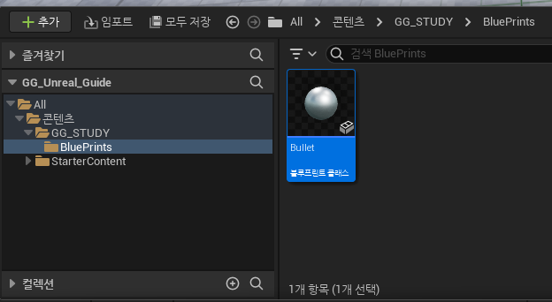
>   콘텐츠 드로어에서 'Bullet' 클래스를 찾아 더블클릭 하여 에디터로 들어갑니다.
>>   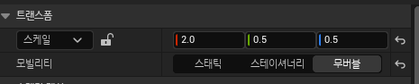
>   총알의 scale 값을 다음과 같이 변경합니다.(x는 회전값 테스트 이후에 0.5로 다시 변경합니다.)

>>   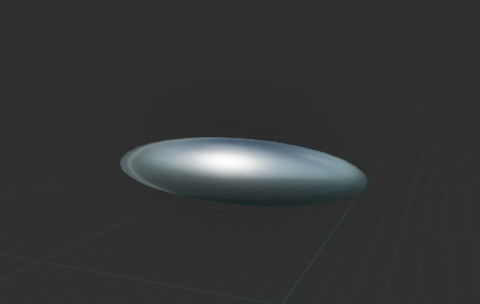
>   이제 좌우로 쭉 늘어난 모습의 총알이 되었으니 회전을 하게되면 눈으로 확인할 수 있게 되었습니다.

## 2.캐릭터 폰의 회전값 적용해보기
> 사실 캐릭터의 현재 회전값을 적용하는 방법은 저번 강의를 들었다면 쉽게 추측해 볼 수 있을 것입니다.
>   저번 시간에 'Player Pawn'의 Location값을 받아왔던 것 처럼 Rotation값을 받아와서 'Spawn Actor ~' 노드에 넘겨주면 될 것 같다는 느낌이 드네요.
> 사진을 통해 함꼐 보도록 하겠습니다.
>   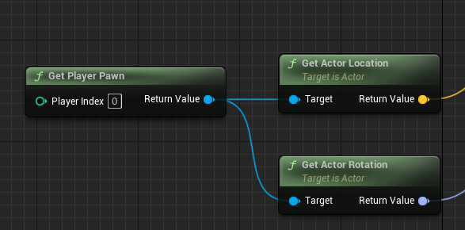
>   먼저 'Get Player Pawn'의 'Return Value' 핀을 끌어서 'Get Actor Rotation' 노드와 연결해줍니다.
> 
>   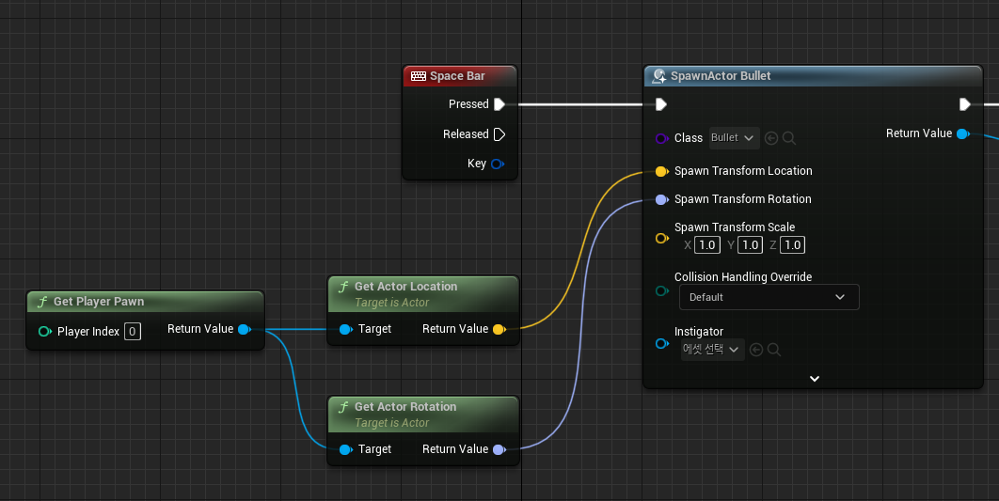
>   그리고 'Get Actor Rotation' 노드의 'Return Value' 핀을 'Spawn Actor ~'노드의 'Rotation' Input 핀에 연결하여 캐릭터 폰의 회전값을 생성되는 총알에 적용시켜 줍니다.
>    이제 플레이어 폰의 회전값을 총알에 적용시켰습니다. 플레이 버튼을 눌러서 확인해 봅시다.
>   아직 총알은 내가 보는 방향과 상관없이 앞으로만 나가기 때문에 확인하기는 힘들지만 카메라를 조금 돌려서 총알을 쏴도 총알이 전혀 회전하지 않음을 확인할 수 있습니다.
>   어쨰서 총알에 플레이어 폰의 회전값이 적용되지 않았을까요?
>   플레이하는 도중에 'F8' 버튼을 눌러서 폰에서 빠져나와보면 그 이유를 확인할 수 있습니다.
>>  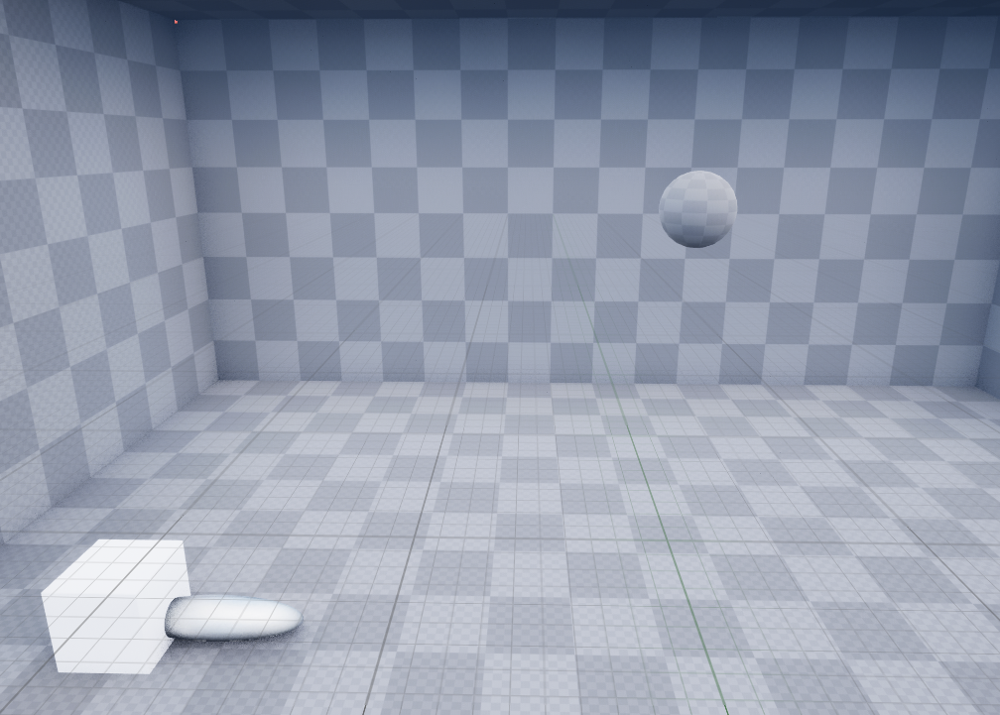
>   위에 보이는 구체가 우리가 빙의하고 있는 'Player Pawn'입니다. 액터 이름은 'DefaultPawn0'이네요.
>>  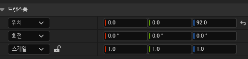
>   이 폰의 현재 transform값 입니다. 이 수치를 기억해두시고 다시 'F8'을 눌러서 빙의한 다음 카메라를 180도 돌려서 뒤로 걸어가봅시다.

>>   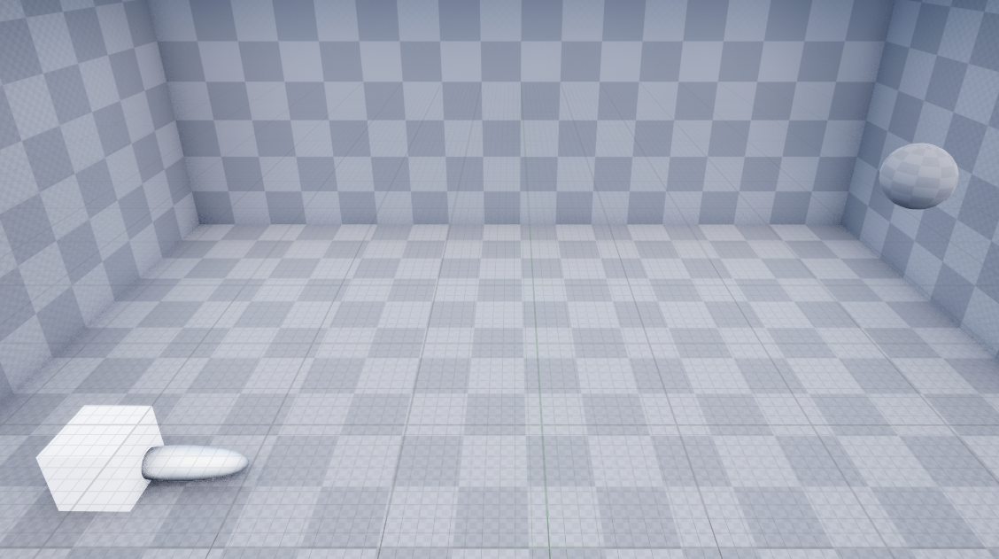
>   아까 위치에서 뒤로 180도 회전한 다음 벽에 가까워지도록 걸어간 모습입니다. 걸어간 만큼 실제 'Player Pawn'의 위치도 변한 것을 확인 할 수 있습니다.
>>   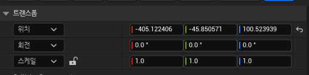
>   이동한 뒤의 폰의 transform값 입니다. 위의 수치와 비교해보면 Location값은 걸어간 만큼 변화했음을 확인할 수 있습니다. 하지만 Rotation값은 변하지 않았습니다. 어떻게 된 것일까요?
>   그 이유는 언리얼 내부적으로 'Pawn'은 카메라 회전과 함께 회전하도록 되어있지 않습니다. 그럼 우리는 어떻게 캐릭터의 회전값을 받아올 수 있을까요?

## 3.Get Control Rotation
> 위의 질문에 대한 해답으로 'Get Control Rotation'노드를 사용하면 캐릭터의 회전값을 받아올 수 있습니다.
>   블루프린트로 돌아가서 'Get Actor Rotation'대신 'Get Control Rotation'을 연결해봅시다.(핀 연결을 쉽게 끊으려면 연결된 핀을 클릭하고 'Alt+클릭'을 하시면 됩니다.)

>>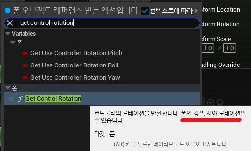
>  'Get Control Rotation'노드는 컨트롤러의 Rotation값을 반환하는데, 폰일 경우 시야 Rotation값이 된다고 합니다.
> 플레이 버튼을 눌러서 테스트해보면 이제 총알이 정상적으로 회전함을 확인할 수 있습니다.

## 4. 전방 벡터(Forward Vector)란?
> 아직 하나 중요한 문제가 남았습니다. 아직도 총알이 카메라가 보는 정면이 아닌, 처음 시작했을 때 기준 정면으로 발사가 되고 있습니다.
>  이 문제를 해결하기 위해서는 벡터에 대한 간단한 이해가 필요합니다.
> 사진을 통해 현재 총알을 발사하는 방식을 보도록 하겠습니다.
>>   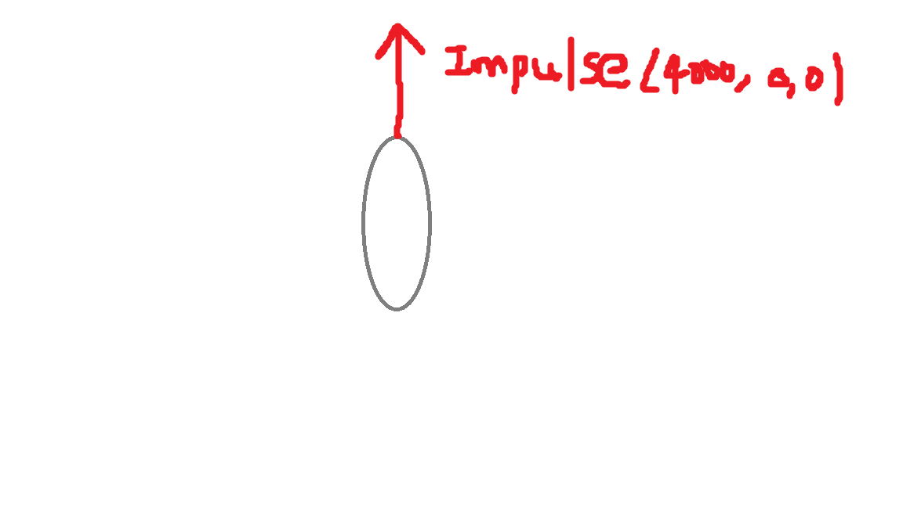
>   현재 우리가 총알을 발사하는 방식은 위 그림과 같습니다. 처음 화면 기준 앞쪽(양의 x방향)으로 4000만큼의 크기의 임펄스를 주어서 총알을 발사하고 있습니다.
>   이 방식은 우리가 평생 앞으로만 쏠 계획이라면 큰 문제가 되지 않습니다. 하지만 캐릭터가 회전하게 되면(총알도 회전하게 됨) 아래와 같은 문제가 발생합니다.

>>   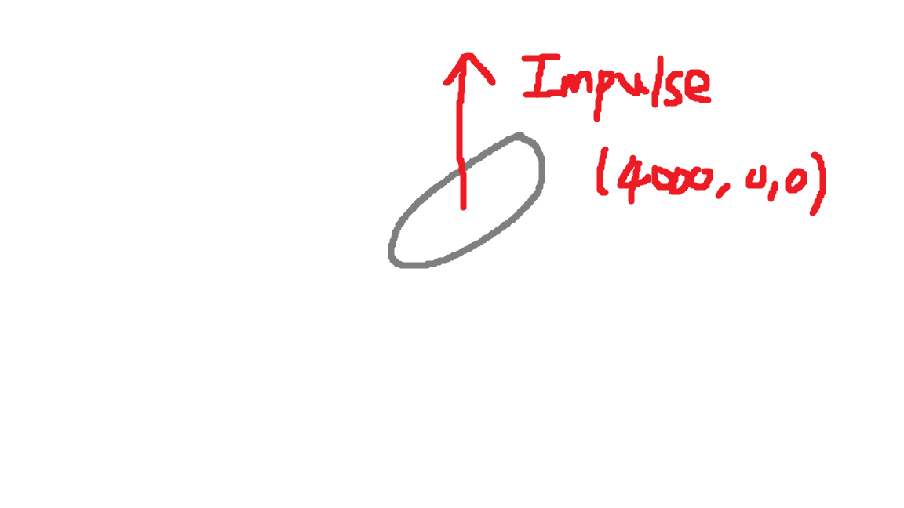
> 총알이 회전했음에도 고정된 임펄스 벡터를 곱하고 있기 때문에 카메라의 회전(총알의 회전)을 총알에 반영하지 못하고 있던 것이죠. 이를 해결하기 위해 우리는 총알이 회전했을 때 어디를 바라보고 있는지 알 필요가 있습니다.
>  그때 필요한 것이 바로 전방 벡터(Forward Vector)입니다. 전방 벡터는 현재 물체의 양의 x방향으로의 크기가 1인 벡터입니다.
>   이제 총알이 바라보는 방향에 대해 알게 되었으니 이를 사용하여 총알을 발사해보도록 하겠습니다.
>>   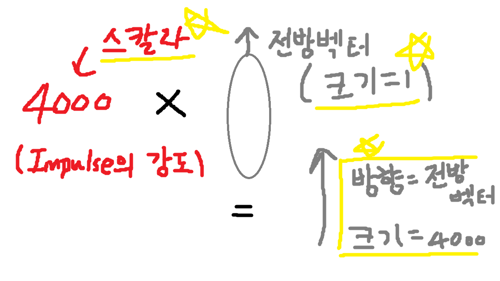
>   총알을 회전하지 않았을 때 전방벡터를 사용한 총알 발사는 위와 같이 이루어집니다. 총알의 전방 벡터에 우리가 원하는 임펄스 크기만큼의 스칼라 값을 곱하면 됩니다. 이 방법을 사용하면 총알을 회전했을 때 발생했던 문제를 해결할 수 있습니다.
>>   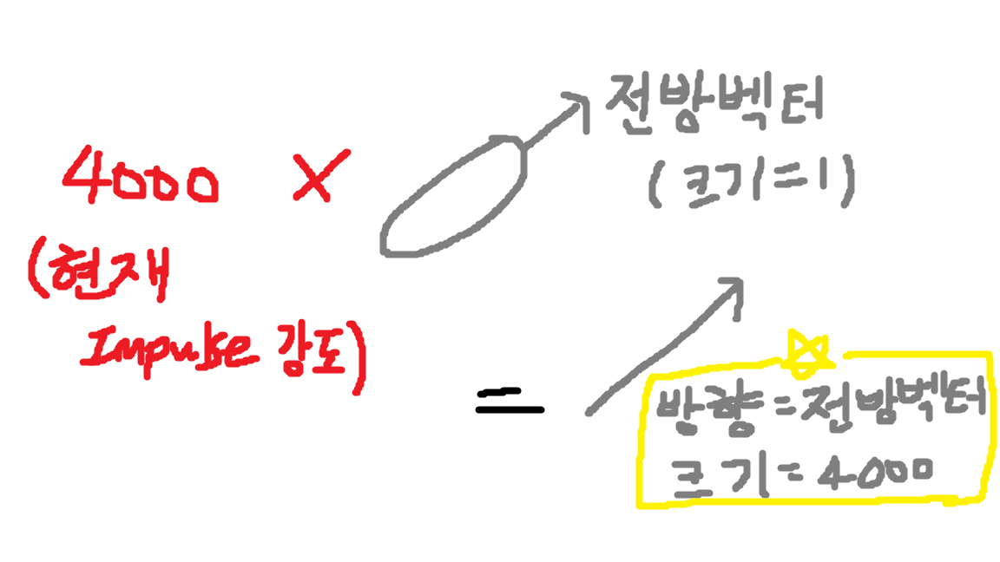
>   총알이 회전하게 되면 전방벡터도 같이 회전하게 되므로 그 방향으로 임펄스 크기만큼 곱한 벡터로 총알이 발사되게 됩니다. 이제 총알 발사 방법에 대해 알아보았으니 블루프린트로 구현해보도록 하겠습니다.

## 5. 전방 벡터(Forward Vector)로 총알 발사 수정
>>   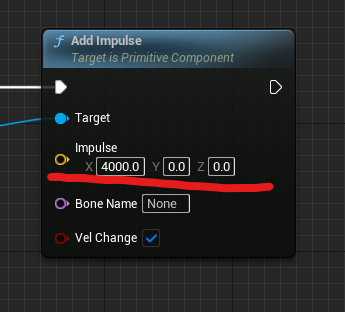
>   우리가 고쳐야할 부분은 고정되어 있는 'Impulse' 벡터 값입니다. 이 벡터 값을 전방벡터*크기(4000)한 벡터로 수정해야 합니다.

>>   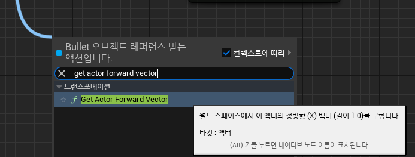
>   'Get Actor Forward Vector'를 사용하면 액터의 전방벡터를 얻을 수 있습니다. 우리는 생성된 'Bullet'액터의 전방벡터가 필요하므로
> 'Spawn Actor ~'의 Return Value('Bullet' 오브젝트의 레퍼런스)에 연결하여 생성된 'Bullet'오브젝트의 전방벡터를 얻어오도록 합니다.

>>   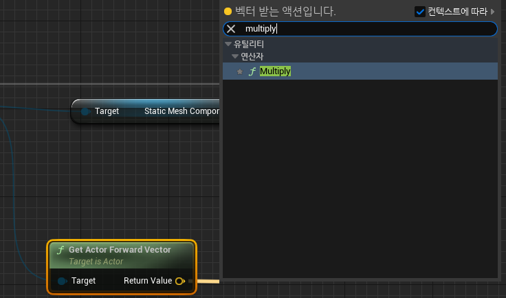
>  그리고 우리는 총알에 4000만큼의 임펄스 크기를 주고 싶으므로 얻어온 전방벡터의 'Return Value'에 'Multiply'노드를 통해 4000을 곱해주도록 하겠습니다.
>
>>   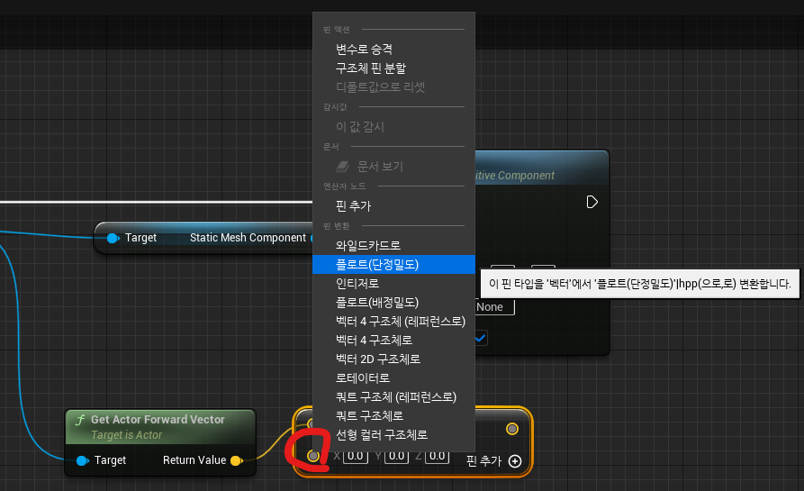
>  전방 벡터의 리턴 값은 벡터이기 때문에 자동으로 벡터의 곱셈으로 되어있는데 핀 부분을 우클릭하여 플로트로 변경해준 뒤 4000만큼을 곱해줍니다.
>>   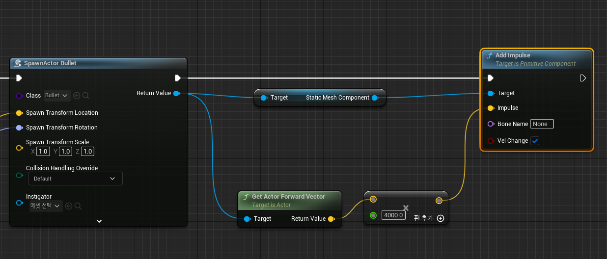
>  최종적으로 아래와 같은 모습이 되도록 한 뒤 플레이 버튼을 눌러 테스트 해보면 이제 총알이 내가 지켜보는 방향으로 발사되는 것을 확인할 수 있습니다.

## 6.마무리
> 이제 총알이 회전하는지 확인이 끝났으므로 'Bullet'클래스 에디터로 들어가서 스케일 값을 (0.5/0.5/0.5)로 변경해줍니다.
---

## 다음 시간에 할 내용
> 오늘은 폰의 시야 Rotation값을 받아와서 총알을 회전시키고 회전한 총알의 전방벡터를 활용하여 내가 바라본 방향으로 총알이 발사되도록 해보았습니다.
> 다음 시간에는 Branch를 사용하여 남은 총알 개수에 따른 분기점을 나누어 보도록 하겠습니다.

